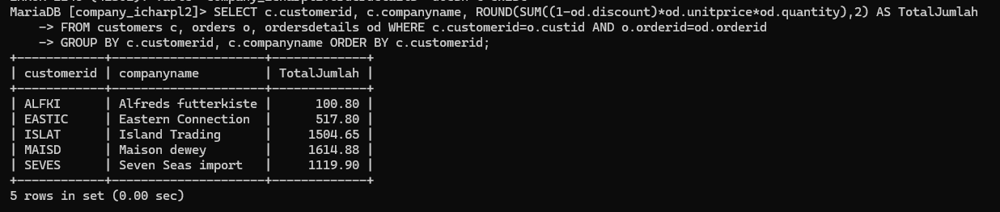

# DEADLINE: 7 Agustus Pukul 20.00 WITA
PENGUMPULAN: via Google Form dengan mengirimkan link github

1. Buat database dengan nama company_namamu misal company_valen
2. Buatlah tabel dengan nama pegawai menggunakan perintah CREATE TABLE ...

Ketentuan tabel: tipe data dan constraintnya
- NIP: int & primary key
- NDep: varchar & NOT NULL
- NBlk: varchar
- JK: enum, NOT NULL
- Alamat: text, NOT NULL
- Telp: varchar, NOT NULL
- Jabatan: enum
- Gaji: BIGINT, NOT NULL
- NoCab: Varchar, NOT NULL

2. Masukkan data-data sesuai dengan yang ada di gambar dengan perintah INSERT INTO
3. Buat folder obsdian dengan nama BASIS DATA - XII dan buat file baru dengan nama Agregasi dengan GROUP BY & HAVING
4. Masukkan hasil struktur tabel pegawai tsb menggunakan perintah DESC di file obsidian kalian
5. Masukkan pula hasil data pada tabel pegawai menggunakan perintah SELECT di file obsidian kalian
6. Buat repositorty baru di github dengan nama BASIS DATA - XII
7. Hubungkan catatan lokal kalian ke github
8. Kirim linknya ke form pengumpulnaa tugas

# 1. Masukkan hasil struktur tabel pegawai tsb menggunakan perintah DESC di file obsidian kalian

Hasil struktur tabel pegawai


- `desc pegawai`;` 
Kueri ini digunakan untuk menampilkan struktur tabel `pegawai`, termasuk nama kolom, tipe data, batasan null/bukan null, batasan kunci, nilai default, dan informasi tambahan. Output kueri ini memberikan gambaran umum yang jelas tentang skema tabel, yang berguna untuk memahami data yang tersimpan dalam tabel.

- `NIP (Nomor Induk Pegawai)`: Bidang ini adalah tipe data integer dan bertindak sebagai kunci utama untuk tabel. Bidang ini tidak boleh null, yang berarti bahwa setiap baris dalam tabel harus memiliki nilai NIP yang unik.
- `NDep (Nama Departemen)`: Ini adalah kolom varchar yang menyimpan nama departemen. Kolom ini tidak boleh null, yang berarti bahwa setiap karyawan harus dikaitkan dengan suatu departemen.
- `NBlk (Nama belakang)`: Ini adalah kolom varchar yang menyimpan nama belakang Kolom ini tidak boleh null, yang berarti bahwa setiap karyawan harus dikaitkan dengan nama belakang.
- `JK (Jenis Kelamin)`: Ini adalah kolom enum yang menyimpan jenis kelamin karyawan, dengan kemungkinan nilai 'L' (Laki-laki) atau 'P' (Perempuan). Kolom ini tidak boleh null, yang berarti bahwa setiap karyawan harus memiliki jenis kelamin yang ditentukan.
- `Alamat`: Ini adalah kolom teks yang menyimpan alamat karyawan. Kolom ini tidak boleh kosong, yang berarti setiap karyawan harus memiliki alamat.
- `Telp (Telepon)`: Ini adalah kolom varchar yang menyimpan nomor telepon karyawan. Kolom ini tidak boleh kosong dan harus unik, yang berarti setiap karyawan harus memiliki nomor telepon yang unik.
- `Jabatan`: Ini adalah kolom enum yang menyimpan posisi pekerjaan karyawan, dengan kemungkinan nilai 'Manajer', 'Penjualan', atau 'Staf'. Kolom ini tidak boleh kosong, yang berarti bahwa setiap karyawan harus memiliki posisi pekerjaan yang ditentukan.
- `Gaji (Gaji)`: Ini adalah kolom bigint yang menyimpan gaji karyawan. Kolom ini tidak boleh null, yang berarti setiap karyawan harus memiliki gaji yang ditentukan.
- `NoCab (Nomor Cabang)`: Ini adalah kolom varchar yang menyimpan nomor cabang. Kolom ini tidak boleh null dan merupakan bagian dari indeks multikolom, yang berarti bahwa kombinasi NoCab dan satu atau beberapa kolom lainnya harus unik.

Jadi Constraint dalam tabel database digunakan untuk menjaga integritas dan konsistensi data, seperti memastikan keunikan, kewajiban isian, validasi nilai, serta hubungan antartabel.


# 2. Masukkan pula hasil data pada tabel pegawai menggunakan perintah SELECT di file obsidian kalian

Hasil data tabel Pegawai


- `SELECT * FROM pegawai;` Ini adalah query untuk menampilkan semua kolom dan baris dari tabel `pegawai`.
- Hasil keluaran menunjukkan 9 baris data yang berisi informasi lengkap mengenai para pegawai, termasuk NIP, NDep, NBlk, JK, Alamat, Telp, Jabatan, Gaji, dan NoCab.

 Jadi dapat disimpulkan bahwa:

1. Tabel `pegawai`memiliki 9 baris data yang menampilkan informasi tentang para pegawai.
2. Tabel ini memiliki 9 kolom, yaitu `NIP`, `NDep`, `NBlk`, `JK`, `Alamat`, `Telp`, `Jabatan`, `Gaji`, dan `NoCab`.
3. Setiap pegawai memiliki data yang lengkap, termasuk nomor induk pegawai (NIP), departemen (NDep), nama blok (NBlk), jenis kelamin (JK), alamat, nomor telepon (Telp), jabatan, gaji, dan nomor cabang (NoCab) .
4. Terdapat 4 pegawai dengan jabatan Manajer, 3 pegawai dengan jabatan Sales, 2 pegawai dengan jabatan Staf, dan 1 pegawai yang tidak memiliki jabatan yang terdata.
5. Rentang gaji pegawai berada di antara Rp1.725.000,- hingga Rp6.250.000,-.

Secara keseluruhan, tabel `pegawai`ini menyediakan informasi yang cukup lengkap mengenai para pegawai beserta detail-detail terkait.


# PENJELASAN GROUP BY & HAVING  Praktikum 5:

1. SELECT COUNT

```SQL
SELECT COUNT(NIP) AS JumlahPegawai, COUNT(Jabatan) AS JumlahJabatan FROM pegawai;
```

 

- SELECT = untuk memilih kolom apa saja yang ingin dipilih (untuk dihitung).
- COUNT (NIP) = untuk menghitung Jumlah barisan data yang mempunyai dari kolom Yan dipilih. NIP adalah nama kolom Yang dipilih untuk dihitung. 
- AS = untuk mengubah nama dari suatu kolom untuk sementara. 
- Jumlah Pegawai = merupakan nama ubahan dari Perintah AS yang digunakan. merupakan nama sementara dari Perintah COUNT (NIP). 
- COUNT (Jabatan) untuk menghitung jumlah barisan data yang mempunyai isi data dan kolom yang dipilih. Jabatan adalah nama kolom Yang dipilih untuk dihitung
- AS = untuk mengubah nama dari suatu kolom untuk sementara. 
- Jumlah Jabatan = merupakan nama sementara dari perintah COUNT (Jabatan). 
- FROM Pegawai = merupakan dari tabel mana datanya yang digunakan Pegawai adalah nama tabel Yang datanya ingin digunakan. 
- Hasilnya = karena ada 9 barisan data, Yang ingin dihitung adalah kolom NIP, Jumlah dari kolom NIP (isi datanya) ada 9, ditampilkan sebagai Jumlah pesawai. Kolom Jabatan Jusa dihitung, akan tetapi ada satu data yang berisi Null (kosong), oleh karena itu hanya ada 8 data ditampilkan sebagai Jumlah Jabatan.


---

 2. SELECT COUN, FROM, WHERE

```SQL 
SELECT COUNT(NIP) AS JumlahPegawai
FROM pegawai 
WHERE NoCab = 'C102';
```


- SELECT = untuk memilih kolom mana saja yang ingin dipilih untuk dihitung. 
- COUNT (NIP) = untuk menghitung Jumlah barisan data yang mempunyai data dari kolom Yang dipilih. NIP adalah nama kolom Yang dipilih untuk Jibitung. 
- As = untuk mengubah nama dari suatu kolom untuk sementura.
- Jumlah Pesawai = nama sementara Yang dipilih untuk kolom COUNT (NIP) 
- FROM Pegawai = dari tabel mana datanya akan digunakan. Pesawai adalah nama tabel Yang dipilih untuk digunakan.
- WHERE = merupakan kondisi Yang harus dipenuhi agar datanya dapat dengan query COUNT (NIP).
- (Nocab = 'C102') = adalah kondisi dari WHERE Yang harus dipenuhi, Jadi hanya barisan data yang memiliki Clo2 di kolom "vocab Yang bisa dihitung. 
- Hasilnya = Di 9 barisan data Yangaja Pada tabel Pegawai, kita ingin menghitung Jumlah barisan data yang memiliki nilai 'clo₂ Pada kolom "Nocab" nya dengan menggunakan COUNT. Jadi Yang muncul adalah 3 0 barisan data. kita Juga ingin mengubah nama dari kolom hasil Perintah COUNT secara sementara dengan Perintah AS, namanya adalah Jumlah Pegawai.


---

3. SELECT COUNT, FROM, GROUP BY

```SQL
SELECT NoCab, COUNT(NIP) AS Jumlah_Pegawai
FROM pegawai
GROUP BY NoCab;
```


- SELECT untuk memilih kolom mana saja yang ingin dihitung atau ditampilkan. 
- Nocab = merupakan nama kolom Yang ingin ditampilkan. 
- COUNT (NIP) = untuk menghitung Jumlah barisan data Yang mempunyai isi data dari kolom Yang dipilih. NIP adalah nama kolom yang dipilih untuk dihitung.
- AS untuk mengubah nama dari suatu kolom untuk sementara.
- Jumlah Pegawai = merupakan nama sementara dari - kolom hasil COUNT (NIP). 
- FROM Pegawai dari tabel mana Yang data kolomnya ingin digunakan. Pesawai adalah nama tabel Yang dipilih untuk digunakan. 
- GROUP BY untuk mengelompokkan data berdasarkan nilai data yang telah ditentuka Pada kolom Yang dipilih. 
- Nocab hama kolom Yang dipilih untuk datanya dikelompokkan. 
- Hasilnya = Berdasarkan. 9 barisan data, masing-masing. nilai, dalam kolom Nocab


---

4.  SELECT SUM, FROM

```SQL
SELECT NoCab, COUNT(NIP) AS Jumlah_Pegawai
FROM pegawai
GROUP BY NoCab
HAVING COUNT(NIP) >= 3;
```


- SELECT = untuk memilih kolom mana sasa Yang ingin dihitung atau ditampilkan.
- Nocab = merupakan nama kolom yang ingin ditampilkan.
- COUNT (NIP) = untuk menghitung jumlah barisan data yang mempunyai isi data dari kolom Yang dipilih. NIP adalah nama kolom Yang dipilih untuk dihitung. 
- AS = untuk mengubah nama dari suatu kolom untuk sementara.
- Jumlah-Pegawai = nama sementara dari kolom hasil COUNT (NIP). 
- FROM Pegawai = untuk memilih dari tabel mana Yand data kolomnya ingin digunakan.Pesawai adalah nama tabel Yang dipilih untuk digunakan. 
- GROUP BY = untuk mengelompokkan data berdasarkan nilai data Yang telah ditentukan Pada kolom Yan dipilih. Nocab-nama kolom Yang dipilih untuk dikelompokkan datanya.
- HAVING = untuk menentukan kondisi (Yang hans dipenuhi) oleh suatu kelompok data agar bisa ditampilkan. 
- (COUNT (NIP) >= 3) = merupakan kondisi Yang harus dipenuhi oleh suatu kelompok data. Jadi hanya kelompok data Yang hasil hitungannya lebih atau Sama dengan 3.
- Hasilnya seperti sebelumnya, ada 9 barisan data dibadi sesuai Nocab nya masing- -masing. Namun Yang ingin ditampilkan adalah hasil hitungan yang lebih dari atau sama dengan 3. Yaitu Nocab C102 Yang ada 3. Yand lain clol ada 2, c103 ada 2, c104 ada 2.

---

5. SELECT SUM

```SQL
SELECT SUM(Gaji) AS Total_Gaji
FROM pegawai;
```


- SELECT = untuk memilih kolom mana saja yang dipilih untuk dijumlahkan.
- SUM (Gaji) untuk menghitung Jumlah data (khusus andka) Pada kolom Yang dipilih. Gaji merupakan nama kolom Yang dipilih untuk dihitung Jumlah isi datanya
- AS = untuk mengganti nama dari kolom hasil Sum (Gaji) untuk sementara.
- Total_Gaji = merupakan nama sementara dari perintah As. 
- FROM Pegawai = untuk memilih dari tabel mana Yang kolom datanya akan digunakan. Pegawai adalah nama dari tabel Yang dipilih. 
- Hasilnya = kolom gaji Yang isi datanya berupa angka-angka, semuanya dijumlahkan menjadi satu seperti ditotalkan (Sama seperti matematika Pada umumnya). 
- hasilnya adalah 30 575 000. Adapun nama kolom dari hasil Jumlah tersebut diubah dari SUM(Gasi) menjadi Total-gaji.


---

 6. SELECT SUM, FROM, WHERE

```SQL
SELECT SUM(Gaji) AS Gaji_Manajer
FROM pegawai
WHERE Jabatan = 'Manajer';
```


- SELECT = untuk memilih kolom mana saja yang dipilih untuk dijumlahkan. 
- Sum (Gaji) = untuk menghitung Jumlah isi data (khusus angka) Pada kolom Yang dipilih. Gaji adalah nama kolom Yang dipilih untuk dijumlahkan isi datanya.
- AS = untuk mengganti nama dari kolom hasil SUM (Gaji) secara sementara. 
- Gaji_Manager = merupakan nama Sementara dari Perintah AS. 
- FROM Pegawai = untuk memilih dari tabel mana Yang kolom datanya akan digunakan. Pegawai adalah nama dari table yang dipilih. 
- WHERE = kondisi Yang harus dipenuhi oleh suatu kolom agar datanya bisa dijumlah.
- (Jabatan = "manager") =  merupakan kondisi dari wHERE. Hanya barisan data yang kolom Jabatannya bersi kolom Gajinya bisa diJumlahkan. 
- Hasilnya = barison data Yang kolom Jabatannya berisi manajer akan dijumlah kolom Gajinya menjadi. 17250 000. Jadi hanya beberapa kolom. Saja yang dijumalah 


---


7. SELECT, FROM, GROUP BY

```SQL
SELECT NoCab, SUM(Gaji) AS TotalGaji
FROM pegawai
GROUP BY NoCab;
```


- SELECT = untuk memilih Kolom mana saja yang dipilih untuk ditampilkan/dijumlahkan. 
- Nocab = adalah nama kolom yang ingin ditampilkan. 
- SUM (Gaji) = untuk menghitung Jumlah data (khusus angka) Pada kolom Yang dipilih. Gaji adalah nama kolom Yang dipilih untuk dijumlahkan isi datanya. 
- AS = untuk mengganti nama dari kolom hasil SUM(Gaji) untuk sementara. 
- Totalgaji = merupakan nama sementara dari Perintah AS. 
- FROM Pegawai =untuk memilih dari tabel mana Yang data kolomnya akan digunakan. Pegawai adalah nama tabel yang dipilih. 
- GROUP BY = untuk mengelompokkan data berdasarkan nilai data yang telah ditentukan pada kolom yang dipilih.
- Nocab = nama kolom Yang datanya dipilih untuk dikelompokkan. 
- Hasilnya = Jadi, berdasarkan kolom Nocab, barisan data yang kolom Nocab nya bensi clol maka kolom Gaji dari barisan data itu dijumlahkan bersama barisan data Yang memiliki Nocab clol dua. Maka kolom Gaji dijumlahkan sesuai dengan kolom Nocab nya masin-masing, mulai dari c101 memiliki 2 kolom Gaji Yang bisa dijumlahkan. Sama dengan c103 dan c104. Adapun cl02 memiliki 3 kolom Gaji yang dapat dijumlahkan. Total Gaji merupakan hasil Perintah dari AS untuk mengubah nama kolom hasil dari Sum(Gaji). 


---

8. SELECT, FROM, GROUP BY, HAVING

```SQL
SELECT NoCab, SUM(Gaji) AS Total_Gaji
FROM pegawai
GROUP BY NoCab
HAVING SUM(Gaji) >= 8000000;
```


- SELECT = untuk memilih kolom mana saja yang dipilih untuk ditampilkan / dijumlahkan.
- Nocab nama kolom Yang dipilih untuk ditampilkan. 
- SUM(Gaji) = untuk menghitung Jumlah data (khusus angka) Pada kolom Yang dipilih. Gaji, adalah nama kolom Yang dipilih untuk dijumlahkan isi datanya. 
- AS = untuk menganti nama dari kolom hasil Sum (Gaji) untuk sementara. 
- Total_Gaji = nama Sementara dari Perintah AS. 
- FROM Pegawai = untuk memilih dari tabel mana Yang data kolomnya ingin digunakan. Pegawai adalah nama dari tabel yang dipilih. 
- GROUP BY = untuk mengelompokkan data berdasarkan nilai data Yang telah ditentukan Pada kolom yang dipilih. 
- Nocab = nama kolom Yang dipilih untuk datanya dikelompokkan. 
- Having = kondisi Yang harus dipenuhi oleh suatu kelompok data agar bisa ditampilkan. 
- (SUM (Gaji) >= 8000000) = Kondisi dari HAVING, Hasil dari Penjumlahan Gaji Yang hanya bisa ditampilkan adalah Hasil yang lebih dari atau sama dengan 8000000. 
- Hasilnya = Sama seperti sebelumnya, tetapi No cab Yang memenuhi kondisi tersebut hanyala clo2 dan c103 karena hasil Jumlah kolom Gaji nya lebih dari atau sama dengan 8000000. Adapun hasil kolom SUMCGaji) diganti Jadi Total_Gaji.


---

9. SELECT AVG

```SQL
SELECT AVG(Gaji) AS Rata_rata
FROM pegawai;
```


- SELECT = untuk memilih kolom mana Sara Yang dipilih untuk ditampilkan. 
- AVG (Gaji) = untuk menghitung rata-rata dari data yang ada pada kolom Yang dipilih. Gaji adalah nama kolom Yang dipilih untuk dihitung rata-ratanya.
- AS = untuk menganti nama dari kolom hasil AVG (Gari) untuk sementara. 
- Rata-rata = nama sementara dari Perintah AS.
- FROM Pegawai = untuk memilih dari tabel mana Yang data kolomnya ingin digunakan. Pegawai adalah nama dari tabel yang dipilih.
- Hasilnya = 3397222.2222 merupakan hasil rata-rata dari semua 9 barisan data Pada kolom Gaji. Adapun nama kolom hasil dari AVG (Gaji) Yaitu Rata-rata. 


---

10. SELECT, FROM, WHERE

```SQL
SELECT AVG(Gaji) AS RataMgr
FROM pegawai
WHERE Jabatan = 'Manajer';
```


- SELECT untuk memilih kolom mana saja yang dipilih untuk ditampilkan. 
- AVG (Gaji) = untuk menghitung rata-rata dari data yang ada pada kolom Yang dipilih Gaji adalah nama kolam Yang dipilih untuk dihitung rata-ratanya. 
- AS = untuk mengganti nama dari kolom hasil AVG (Gaji) untuk sementara. 
- Gaji Ratamgr = nama sementara dari Perintah AS. 
- FROM Pegawai = untuk memilih dan tabel mana Yang data kolomnya ingin digunakan Pegawai adalah nama dari tabel Yang dipilih. 
- WHERE = Kondisi Yang harus dipenuhi oleh suatu kolom agar datanya bisa dihitung rata-ratarya 
- (Jabatan = 'Manajer') kondisi dari wHERE. Barisan data yang kolom Jabatannya Manajer akan dihitung rata-rata kolom Gajinya. 
- Hasilnya = 5750000.0000 merupakan hasil hitung rata-rata dari barisan data yang memiliki manajer di kolom Jabatan nya, dari situ kolom Gaji nya di hitung..


---

11. SELECT AVG, FROM, GROUP BY


```SQL
SELECT NoCab, AVG(Gaji) AS RataGaji
FROM pegawai
GROUP BY NoCab;
```


- SELECT = untuk memilih Kolom mana saja yang dipilih untuk ditampilkan, dihitung. 
- Nocab = Kolom Yang dipilih untuk ditampilkan. 
- AVG (Gaji) = untuk menghitung rata-rata dari data yang ada pada kolom Yang dipilih. Gaji adalah nama kolom Yang dipilih untuk dihitung rata-ratanya. 
- As = untuk menganti nama dari kolom hasil AVG(Gajii) untuk sementara. 
- Rata Gaji = adalah nama sementara dari Perintah As. 
- FROM Pegawai = untuk memilih dan tabel mana yang data kolomnya ingin digunakan. Pegawai adalah nama dari tabel yang dipilih. 
- GROUP BY = untuk mengelompokkan data berdasarkan nilai data yang telah ditentukan.Pada kolom Yong dipilih.
- Nocab = nama kolom Yang dipilih untuk datanya dikelompokkan. 
- Hasilnya = Hampir sama seperti no.7, masing-masing kolom Nocab dihitung rata-ratanya.


---

12. SELECT, FROM, GROUP BY, HAVING

```SQL
SELECT NoCab, AVG(Gaji) AS RataGaji
FROM pegawai
GROUP BY NoCab
HAVING NoCab = 'C101' OR NoCab = 'C102';
```


- SELECT = untuk memilih kolom mana saja yang dipilih untuk ditampilkan, dihitung.
- Nocab = Kolom Yong dipilih untuk ditampilkan. 
- AVG (Gaji) = untuk menghitung rata-rata dari data yang ada pada kolom Yang dipilih. Gaji adalah nama kolom Yang dipilih untuk dihitung rata-ratanya.
- AS = untuk menganti nama dari kolom hasil AVG (Gaji) untuk sementara. 
- rata Gaji = nama sementara dari Perintah As. 
- FROM Pegawai untuk memilih dari tabel mana Yang datanya Kolomnya ingin dignakan Pegawai adalah nama dari tabel Yang dipilih. 
- GROUP BY = untuk mengelompokkan data berdasarkan nilai data Yang telah ditentukan Pada kolom Yang dipilih.
- Nocab = nama Kolom Yand dipilih untuk datanya dikelompokkan.
- HAVING = kondisi Yang harus dipenuhi oleh suatu kelompok data. 
- (Nocabc101' OR Nocab = 'c102') = merupakan kondisi dari Having. Jadi kolom Nocab Yang memiliki c101 atav C102 Yang hanya akan ditampilkan. OR adalah kondisi Yang hanya salah satu datanya yang harus dipenuhi.


---

13. SELECT MAX

```SQL
SELECT MAX(Gaji) AS GajiTerbesar, MIN(Gaji) AS GajiTerkecil
FROM pegawai;
```


- SELECT = untuk memilih kolom mana saja yang dipilih untuk ditampilkan.
- MAX(gaji) = untuk menampilkan nilai maksimum atau terbesar / tertinggi dari suatu data dalam kolom Yang dipilih. Gaji adalah nama kolom Yang dipilih.
- As Gajiterbesar = untuk mengganti nama dari kolom hasil Min(Gaji), menjadi nama Sementaranya Yaitu Gaji Terbesar. 
- MIN (Gaji) = untuk menampilkan nilai minimum atau terkecil/terendah dari suatu data dalam kolom yg dipilih. Gaji adalah nama kolam Yang dipilih.
- As Gaji Terkecil = untuk mengganti nama dari kolom hasil MIN (Gaji) menjadi Gaji Terkecil untuk sementara. 
- FROM Pegawai = untuk memilih dari tabel mana yang dat kolomnya ingin ditampilkan. 
- Hasilnya = Jadi dari 9 nilai yang ada di kolam Gaji, Gaji maksimumnya adalah 6250000 dan namanya diubah menjadi Gajiterbesar. Gajii minimumnya adalah 1725000 dan namanya diubah menadi Gajiterkecil. 


---

14. SELECT MAX

```SQL
SELECT MAX(Gaji) AS GajiTerbesar, MIN(Gaji) AS GajiTerkecil
FROM pegawai
WHERE Jabatan = 'Manajer';
```


- SELECT = untuk memilih kolom mana saja yang dipilih untuk ditampilkan.
- MAX (Gaji) = untuk menampilkan nilai terbesar dari suatu data dalam kolom Yang dipilih Gajii adalah nama kolom yang dipilih. 
- AS GajiTerbesar = untuk mengganti nama dari kolom hasil max (Gaji) menjadi Gajiterbesar untuk sementara. 
- MIN (Gaji) = untuk menampilkan nilai terkecil dari Suatu data dalam kolam Gaji adalah nama kolom Yang dipilih. 
- AS Gajiterkecil = untuk menganti nama dari kolom hasil MIN (Gaji) menjadi Gaji terkecil untuk sementara. 
- FROM Pegawai = untuk memilih dari tabel mana Yand data kolomnya ingin ditampilkan. 
- WHERE kondisi = Yang harus dipenuhi oleh suatu kolom data agar bisa ditampilkan.
- (jabatan Manajer) = kondisi dari WHERE Yang harus dipenuhi. Barisan data yang kolom Jabatannya berisi manajer akan ditampilkan kolom Gajinya.
- Hasilnya Jabatan Manajer Yang memiliki nilai maksimum adalah 6250000 Kolom hasil MAX nya diubah Jadi Gaji terbesar. sedangkan nilai minimumnya adalah $250000 Kolam hasil MIN nya diubah Tadi Gaji Terkecil.


---

15. SELECT, FROM, GROUP BY

```SQL
SELECT NoCab, MAX(Gaji) AS GajiTerbesar, MIN(Gaji) AS GajiTerkecil
FROM pegawai
GROUP BY NoCab;
```


- SELECT = untuk memilih kolom mana saja yang dipilih untuk ditampilkan.
- Nocab= nama kolom Youd ingin ditampilkan. 
- MAX (Gaji) = untuk menampilkan nilai terbesar dari suatu data dalam kolom Yong dish Gari nama kolom Yang dipilih. 
- AS GajiTerbesar = untuk mengganti nama kolom hasil MAX (Gati) menjadi Gaji terbesar untuk sementara.
- MIN (Gaji) = untuk menampilkan nilai terkecil dari suatu data dalam kolom Yang dipilih Gaji nama kolom Yang dipilih. 
- As Gajiterkecil = untuk mengganti nama kolom hasil MIN (Gaji) menjadi Gaji Terkecil untuk sementara. 
- FROM Pegawai = untuk memilih dari tabel mana Yang data kolomnya ingin ditampilkan. Pegawai adalah nama tabel Yang dipilih untuk ditampilkan. 
- GROUP BY = untuk mengelompokkan data berdasarkan nilai data yang telah ditentukan Pada kolom Yan dipilih. 
- Nocab = nama Kolom yang ingin dikelompokkan.  
- Hasilnya = masing-masing Nocab dicari nilai maksimum dan minimumnya. mulai dari clol, c102, c103, c104. dan nama hasil kolannya diubah Jadi Gajiterbesar dan GajiTerkecil. 


---

16. SELECT, FROM, GROUP BY, HAVING COUNT

```SQL
SELECT NoCab, MAX(Gaji) AS GajiTerbesar, MIN(Gaji) AS GajiTerkecil
FROM pegawai
GROUP BY NoCab
HAVING COUNT(NIP) >= 3;
```


- SELECT untuk memilih kolom mana sara Yang dipilih untuk ditampilkan. 
- Nocab = nama kolom Yang ingin ditampilkan. 
- MAX (Gaji) = untuk menampilkan nilai terbesar dan suatu data dalam kolom Yang dipilih Gat adalah nama kolom Yang dipilih. 
- AS Gaiterbesar = untur menssanti nama kolom hasil MAX (Gaji) menjadi GariTerbesar Untuk Sementara.
- MIN (Gaji) = untuk menampilkan nilai terkecil dari suatu data dalam kolom yg dipilih. Gaji adalah nama Kolam Yang dipilih. 
- AS Gaji = Terkecil untuk mengganti nama kolom hasil MIN (Gaji) menjadi Gajiterkecil untuk sementara. 
- FROM Pegawai = adalah untuk memilih dari tabel mana Yang data kolomnya ingin ditampilkan,Pegawai adalah nama tabel Yang dipilih. 
- GROUP BY = untuk mendelompokkan data Pada kolom Yand dipilih.
- Nocab = nama kolom Yand dipilih untuk dikelompokkan. 
- Having = Kondisi Yang harus dipenuhi oleh suatu kelompok data.
- (COUNT(NIP) >= 3)= kondisi dri HAVING. Hanya hasil hitung kolom NIP Yang lebih dari atau sama dengan 3 Yang muncul. 
- Hasilnya seperti no. 4, Yang mempunyai hasil hitung lebih dari atau Sama dengan 3 Nocab C102 Jadi hanya itu Yandg dicari Nilai maksimum dan adalah minimumnya Pada kolom Gaji.


---

17. SELECT COUNT

```SQL
SELECT COUNT(NIP) AS JumlahPegawai, 
       SUM(Gaji) AS TotalGaji,
       AVG(Gaji) AS RataGaji,
       MAX(Gaji) AS GajiMaks,
       MIN(Gaji) AS Gajimin
FROM pegawai;
```


- SELECT = untuk memilih kolam mana saja yang dipilih untuk ditampilkan. 
- COUNT (NIP) = untuk menghitung jumlah barisan data yang ada pada kolam Yang dipilih. 
- AS Jumlah Pesawai = untuk menssanti nama kolam hasil COUNT (NIP) menjadi Jumlah Pegawai. 
- SUM (Gaji) = untuk  menjumlah data Yang ada pada kolom Yang dipilih. Gaji adalah kojom Yand dipilih.
- AS Total Gaji untuk mengganti nama kolom hasil SUM (Gaji) menjadi Total Gaji. 
- AVG (Gaji) = untuk menghitung rata-ratanya suatu data dalam kolom yang dipilih. Gaji adalah nama kolom Yang dipilih untuk dihitung.
- AS RataGaji = untuk mengganti nama kolom hasil AVG (Gari) menjadi RataGaji. 
- MAX (Gaji) = untuk menampilkan nilai terbesar dari suatu data dalam kolam Yang dipilih Gaji adalah nama kolom yang dipilih. 
- AS Gajimaks = untuk mengganti nama dari kolom hasil MAX(Gari) menjadi Garimaks. untuk Sementara.
- MIN (Gaji) untuk menampilkan nilai terkecil dari suatu kalam Yang dipilih. Gaji nama kolom Yang dipilih. 
- AS GajiMIN = untuk menganti nama dari kolom hasil MIN (Gaji) menjadi Gajimin. Untuk sementara. 
- FROM Pegawai = untuk memilih tabel mana yang dipilih untuk ditampilkan. Pegawai adalah nama tabel Yang dipilih.
- Hasilnya = Dihitung berapa NIP, Di Jumlahkan semua data Pada kolom Gaji, Dihitung Rata-tata datri kolom Gaji, Ditampilkan nilai terbesar Pada kolom Gaji, dan Nilai terkecil dalam Kolom Gaji.

---

18. SELECT COUNT, FROM, WHERE, GROUP BY, HAVING

```SQL
SELECT COUNT(NIP) AS JumlahPegawai, 
       SUM(Gaji) AS TotalGaji,
       AVG(Gaji) AS RataGaji,
       MAX(Gaji) AS GajiMaks,
       MIN(Gaji) AS Gajimin
FROM pegawai
WHERE Jabatan = 'Staf' OR Jabatan = 'Sales'  
GROUP BY NoCab
HAVING SUM(Gaji) <= 2600000;
```


- SELECT = untuk memilih kolam mana saja yang ingin digunakan.
- COUNT (NIP) = untuk menghitung barisan data yang ada Pada kolom Yang dipilih.
- AS Jumlah pegawai = untuk mengganti nama dari kolom hasil COUNT (NIP) menjadi Jumlah Pegawai untuk sementara. 
- SUM (Gaji) = untuk menjumlah data Yang ada Pada kolom Yang dipilih.  Gaji adalah nama kolom Yang dipilih. 
- As Total Gaji = untuk mengganti nama dari kolom hasil SUM(Gaji) menjadi Total Gaji Untuk Sementara.
- AVG (Gaji) untuk menghitung rata-rata dari kolom Yand dipilih. Gaji adalah nama kolom Yang dipilih. 
- As Rata Gaji = untuk mengganti nama dari kolom hasil AVG (Gaji) menjadi Rata Gaji Untuk sementara.
- MAX (Gaji) untuk menampilkan nilai  2 terbesar dan suatu data dalam kolom Yang dipilih Gaji adalah nama kolom. Yang dipilih. 


# Materi Relasi Praktikum 7

 Analisis 1
 ```SQL
SELECT orders.OrderID, orders.OrderDate, orders.custID, customers.companyName, customers.City, customers.Phone FROM orders, customers WHERE orders.custID = customers.customerID;
```

 

**PENJELASAN PROGRAM**
 - SELECT = untuk memilih kolom mana saja yang ingin ditampilkan dari tabel mana kolom tersebut diambil.
- orders.OrderID = orders merupakan nama tabel yang ingin ditampilkan kolomnya, yaitu orderID. Jadi kolom orderID pada tabel orders ingin ditampilkan.
- orders.OrderDate = kolom OrderDate pada tabel orders ingin ditampilkan.
- orders.CustID = kolom CustID dalam tabel orders dipilih untuk ditampilkan.
- customers.CompanyName = kolom CompanyName dalam tabel customers dipilih untuk ditampilkan.
- customers.ContactName = kolom ContactName dalam tabel customers dipilih untuk ditampilkan.
- customers.City = kolom City dalam tabel customers dipilih untuk ditampilkan.
- customers.Phone = kolom Phone dalam tabel customers dipilih untuk ditampilkan.
- FROM orders, customers = untuk memilih dari tabel mana saja yang kolomnya ingin dipilih untuk ditampilkan. Orders adalah nama tabel pertama yang dipilih dan customers adalah nama tabel kedua yang dipilih.
- WHERE = kondisi yang harus dipenuhi oleh suatu kolom data agar bisa ditampilkan
- (orders.CustID = customers.CustomerID) = kondisi dari WHERE yang harus dipenuhi: jadi, data pada kolom CustID dalam tabel orders harus sama dengan data pada kolom CustomerID dalam tabel customers agar masing-masing dapat ditampilkan.
- Hasilnya = Jadi yang tampil adalah kolom OrderID, OrderDate dan CustID dari tabel orders dan kolom CompanyName, ContactName, City, dan Phone dari tabel customers.


Analisis 2
 ```SQL
 SELECT o.OrderID, o.OrderDate,o.CustID, c.CompanyName, c.contactName,
  c.City, c.phone
    -> FROM orders o, customers c
    -> WHERE o.CustID = c.CustomerID AND c.City = 'London';
```


**Penjelasan Program** 

- SELECT = untuk memilih kolom mana saja yang ingin ditampilkan dan dari tabel mana kolom tersebut diambil.
- orders.OrderID = orders merupakan nama tabel yang ingin ditampilkan kolomnya yaitu orderID. Jadi kolom orderID pada tabel orders ingin ditampilkan.
- orders.OrderDate = kolom orderDate pada tabel orders ingin ditampilkan.
- orders.CustID = kolom custID dalam tabel orders dipilih untuk ditampilkan.
- customers.CompanyName = kolom companyName dalam tabel customers dipilih untuk ditampilkan.
- customers.ContactName = kolom contactName dalam tabel customers dipilih untuk ditampilkan.
- customers.City = kolom city dalam tabel customers dipilih untuk ditampilkan.
- customers.Phone = kolom phone dalam tabel customers dipilih untuk ditampilkan.
- FROM orders, customers = untuk memilih dari tabel mana saja yang kolomnya ingin dipilih untuk ditampilkan. Orders adalah nama tabel pertama yang dipilih dan customers adalah nama tabel kedua yang dipilih.
- WHERE = kondisi yang harus dipenuhi oleh suatu kolom data agar bisa ditampilkan
- (orders.CustID = customers.CustomerID) = kondisi dari WHERE yang harus dipenuhi Jadi, data pada kolom CustID dalam tabel orders harus sama dengan data pada kolom CustomerID dalam tabel customers agar masing-masing dapat ditampilkan.
- Hasilnya = Jadi yang tampil adalah kolom OrderID, OrderDate dan CustID dari tabel orders dan kolom CompanyName, ContactName, City, dan Phone dari tabel customers.Jadi hanya barisan data yang kolom city dari tabel customers memenuhi data "London" yang bisa tampil.

 Analisis 3
 ```SQL
 SELECT o.OrderID, o.OrderDate, C.CompanyName, c.contactName, e.LastName, e.Title
    -> FROM orders o, customers c, employees e
    -> WHERE o.CustI D = c.CustomerID AND o.EmpID = e.EmpID;
```

  

**Penjelasan Program**

- SELECT = untuk memilih kolom mana saja yang ingin ditampilkan dan dari tabel manakolom tersebut diambil.
- o.OrderID, o.OrderDate = kolom OrderID dan OrderDate dari tabel O(orders) dipilih untuk ditampilkan.
- c.CompanyName, c.ContactName, c.Phone = kolom-kolom CompanyName,
  ContactName dan Phone dari tabel c(customers) dipilih untuk ditampilkan.
- e.LastName, e.Title = kolom LastName dan Title dari tabel e(employees) dipilih untuk ditampilkan.
- FROM orders o, customers c, employees e = untuk memilih dari tabel mana saja yang kolomnya ingin dipilih untuk ditampilkan. Orders disingkat jadi o adalah nama tabel yang dipilih. Customers disingkat jadi c adalah nama tabel yang dipilih. Employees disingkat jadi e adalah nama tabel yang dipilih untuk ditampilkan.
- WHERE = kondisi yang harus dipenuhi oleh suatu data agar bisa ditampilkan. o.CustID = c.CustomerID = data pada kolom CustID dalam tabel o(orders) harus sama dengan data pada kolom CustomerID dalam tabel c(customers).
- AND = untuk menyeleksi dua data atau lebih pada perintah WHERE.
- (o.EmpID = e.EmpID) = data pada kolom EmpID dalam tabel o(orders) harus sama dengan data pada kolom EmpID dalam tabel e(employees).
- Hasilnya = Yang tampil adalah kolom yang memenuhi semua kondisi dari WHERE.


Analisis 4
 ```SQL
 SELECT o.OrderID, o.OrderDate, c.CompanyName, c.contactName, c.Phone, e.LastName, e.Title
    -> FROM Orders o, customers c, employees e
    -> WHERE o.CustID = c.CustomerID AND o.EmpID = e.EmpID
    -> AND e.FirstName = 'Margaret';
```


**Penjelasan Program**

- SELECT = untuk memilih kolom mana saja yang ingin ditampilkan dan dari tabel mana kolom tersebut diambil.
- o.orderID, o.orderDate = kolom orderID dan orderDate dari tabel o (orders) dipilih untuk ditampilkan.
- c.companyName, c.contactName, c.Phone = kolom companyName, contactName dan Phone dari tabel c (customers) dipilih untuk ditampilkan.
- e.LastName, e.Title = kolom LastName dan Title dari tabel e (employees) dipilih untuk ditampilkan.
- FROM orders o, customers c, employees e = untuk memilih dari tabel mana saja yang kolomnya dipilih untuk ditampilkan. Orders atau o adalah nama tabel yang dipilih. Customers atau c adalah nama tabel yang dipilih. Employees atau e adalah nama tabel yang dipilih untuk ditampilkan.
- WHERE = kondisi yang harus dipenuhi oleh suatu kolom data agar bisa ditampilkan.
- (o.custID = c.customerID) = data pada kolom custID dalam tabel o (orders) harus sama dengan data pada kolom customerID dalam tabel c (customers).
- AND = untuk menyeleksi dua data atau lebih pada perintah WHERE.
- (o.EmpId = e.EmpID) = data pada kolom EmpId dalam tabel o(orders) harus sama dengan data pada kolom EmpID dalam tabel e(employees).
- AND = untuk menyeleksi dua data atau lebih pada perintah WHERE.
- (e.FirstName = "Margaret") = data pada kolom FirstName dalam tabel e(employees) harus berisi data "Margaret" agar bisa tampil.
- Hasilnya = Jadi barisan data yang sudah memenuhi kondisi WHERE akan tampil, terutama kolom FirstName dari tabel employees yang isinya "Margaret".

 Analisis 5
 ```SQL
 SELECT c.CustomerID, c.CompanyName, o.OrderID, o.OrderDate,od.ProductID, p.ProducName, od.Quantity AS Qty, od.UnitPrice
    -> FROM customers c, orders o, ordersdetails od, products p
    -> WHERE c.CustomerID = o.CustID AND o.OrderID = od.OrderID AND p.ProductID = od.ProductID ORDER BY c.CustomerID;
```


**Penjelasan Program**

- SELECT = untuk memilih kolom mana saja yang ingin ditampilkan dari dari tabel mana kolom tersebut diambil
- C.CustomerID, C.CompanyName = kolom CustomerID dan CompanyName dari tabel C (customers) dipilih untuk ditampilkan.
- O.OrderID, O.OrderDate = kolom OrderID dan OrderDate dari tabel O (orders) dipilih untuk ditampilkan.
- od.ProductID, od.Quantity, od.UnitPrice = kolom ProductID, Quantity dan UnitPrice dari tabel od (orderdetails) dipilih untuk ditampilkan.
- P.ProductName = kolom ProductName merupakan kolom dari tabel P (Products) yang dipilih untuk ditampilkan.
- od.Quantity AS Qty = kolom Quantity ditampilkan sebagai nama sementaranya yaitu Qty. AS untuk mengubah nama suatu kolom secara sementara.
- FROM customers C, orders O, orderdetails od, products P = untuk memilih dari tabel mana saja yang kolomnya dipilih untuk ditampilkan. Customers atau C adalah nama tabel yang dipilih untuk ditampilkan. Orders atau O adalah nama tabel yang dipilih untuk ditampilkan. Orderdetails atau od adalah nama tabel yang dipilih untuk ditampilkan. Products atau P adalah nama tabel yang dipilih untuk ditampilkan.
- WHERE = kondisi yang harus dipenuhi oleh suatu kolom data agar bisa ditampilkan.
- (C.CustomerID = O.CustID) = data pada kolom CustomerID dari tabel customers atau C harus sama dengan data pada kolom CustID dari tabel orders atau O.
- AND = untuk menyeleksi dua data atau lebih pada perintah WHERE.
- (O.OrderID = od.OrderID) = data pada kolom OrderID dari tabel orders atau O harus sama dengan data pada kolom OrderID dari tabel orderdetails atau od.
- AND = untuk menyeleksi dua data atau lebih pada perintah WHERE.
- (P.ProductID = od.ProductID) = data pada kolom ProductID dari tabel Products atau P harus sama dengan data pada kolom ProductID dari tabel orderdetails atau od.
- ORDER BY C.CustomerID = untuk menurut data berdasarkan kolom CustomerID dari tabel customers
- Hasilnya = kolom-kolom data yang tampil adalah data yang telah memenuhi kondisinyakondisi yang ada, dan seluruh isi data tersebut diurut berdasarkan satu kolom yaitu CustomerID dari tabel customers.


Analisis 6
 ```SQL
SELECT c.CustomerID, c.CompanyName, CONCAT(e.LastName, ', ', e.FirstName) AS
EmployeeName, od.productid as prodID,
p.ProductName, od.quantity AS Qty FROM customers c, orders o, orderdetails
od,products p, employees e
WHERE c.customerid=o.CustomerID and o.orderid =od.orderid and
p.productid=od.productid and e.empid=o.empid order by o.orderID;
```


Penjelasan Program

- SELECT = untuk memilih kolom mana saja yang ingin ditampilkan dan darimana serta dari tabel mana kolom tersebut dipilih.
- C.CustomerID, C.CompanyName = kolom CustomerID dan CompanyName dari tabel C(Customers) dipilih untuk ditampilkan.
- O.OrderID AS OrdID, O.OrderDate = kolom OrderID dan OrderDate dari tabel O(Orders) dipilih untuk ditampilkan. AS merupakan perintah untuk mengubah nama suatu kolom secara sementara. Dalam hal ini kolom OrderID diubah namanya sementara menjadi OrdID.
- CONCAT(E.LastName, ' ', E.FirstName) AS EmployeeName = CONCAT adalah perintah untuk menggabungkan beberapa kolom data menjadi satu kolom data. (E.LastName, ' ', E.FirstName) merupakan kolom-kolom yang ingin digabung. LastName dan FirstName merupakan kolom dari tabel E(Employees) yang ingin digabung. (' ', ' ') merupakan separator atau pemisah dari kedua kolom yang ingin digabungkan. AS EmployeeName untuk mengubah hasil concat tadi menjadi EmployeeName (namanya) untuk sementara.
- od.ProductID AS ProdID, od.Quantity AS Qty = kolom ProductID dan Quantity dari tabel od(orderdetails) dipilih untuk ditampilkan. Kolom ProductID.
- P.ProductName = kolom ProductName dari tabel P(Products) dipilih untuk ditampilkan.
- FROM customers C, orders O, orderdetails od, products P, employees E = untuk memilih dari tabel mana saja yang kolomnya dipilih untuk ditampilkan. Customers atau C adalah nama tabel yang dipilih. Orders atau O adalah nama tabel yang dipilih. Orderdetails od adalah nama tabel yang dipilih. Products atau P adalah nama tabel yang dipilih. Employees atau E adalah nama tabel yang dipilih.
- WHERE = kondisi yang harus dipenuhi oleh suatu kolom data agar bisa ditampilkan.
- (C.CustomerID = O.CustID) = data pada kolom CustomerID dari tabel C(customers) harus sama dengan data pada kolom CustID dari tabel O(orders).
- AND = untuk menyeleksi dua data atau lebih pada perintah WHERE.
- (O.OrderID = od.OrderID) = data pada kolom OrderID dari tabel O(orders) harus sama dengan data pada kolom OrderID dari tabel od(orderdetails).
- AND = untuk menyeleksi dua data atau lebih pada perintah WHERE.
- (P.ProductID = od.ProductID) = data pada kolom ProductID dari tabel P(ProductID) harus sama dengan data pada kolom ProductID dari tabel od(orderdetails)
- AND = untuk menyeleksi dua data atau lebih pada perintah WHERE.
- (E.EmpID = O.EmpID) = data pada kolom EmpID dari tabel E(employees) harus sama dengan data pada kolom EmpID dari tabel O(orders).
- ORDER BY O.OrderID = untuk menurut data berdasarkan kolom OrderID dari tabelorders.
- Hasilnya = kolom LastName dan FirstName dari tabel E(employees) digabung dengan concat dan hasil kolomnya namanya diubah sementara jadi EmployeeName.

Analisis 7
 ```SQL
> CREATE VIEW CustOrderEmp
-> AS
-> SELECT c.CustomerID, c.CompanyName, c.ContactName,
-> o.OrderID, o.OrderDate, o.EmpID, e.LastName, e.FirstName
-> FROM customers c, orders o, employees e
-> WHERE c.CustomerID = o.CustomerID AND o.EmpID = e.EmpID;
```


Penjelasan Program
- CREATE VIEW custorderEmp = merupakan tabel virtual yang dibuat dengan nama custorderEmp.
- AS SELECT = untuk memilih kolom-kolom mana saja yang ingin dipilih untuk dimasukkan ke tabel virtual.
- C.CustomerID, C.CompanyName, C.contactname = kolom customerID, companyName, dan contactname dari tabel c(customers) dipilih untuk dimasukkan ke dalam tabel virtual.
- O.orderID, o.orderdate = kolom orderID dan orderDate dari tabel o(orders) dipilih untuk dimasukkan ke dalam tabel virtual.
- e.EmpID, e.Lastname, e.Firstname = kolom EmpID, lastname, dan firstname dari tabel e(Employees) dipilih untuk dimasukkan ke dalam tabel virtual.
- FROM customers c, orders o, employees e = untuk memilih dari tabel mana saja yang kolomnya dipilih untuk tabel virtual. customers, orders, dan employees merupakan nama tabel yang kolomnya dipilih.
- WHERE = kondisi yang harus dipenuhi oleh suatu data agar bisa dimasukkan ke dalam tabel virtual.
- (C.CustomerID = o.custID) = data pada kolom CustomerID dari tabel c(customers) harus sama dengan data pada kolom custID dari tabel o(orders) agar bisa dimasukkan.
- AND = untuk menyeleksi dua data atau lebih pada WHERE.
- (o.EmpID = e.EmpID) = data pada kolom EmpID dari tabel o(orders) harus sama dengan data pada kolom EmpID dari tabel e(Employees) agar bisa dimasukkan.
- Hasilnya = sebuah tabel virtual telah dibuat dengan nama custorderEmp yang berisi kolom-kolom dari 3 tabel customers, orders, employees dan telah memenuhi semua kondisi.

Memilih data dari View :
 ```SQL
SELECT * FROM CustOrderEmp;
```

Hasil program :


Analisis 8
 ```SQL
CREATE VIEW odproductsc
-> AS
-> SELECT od.OrderID, od.ProductID, p.ProductName,
-> od.Quantity, od.UnitPrice
-> FROM orderdetails od, products 
-> WHERE p.ProductID = od.ProductID;
```


Penjelasan Program : 
- CREATE VIEW odProducts = untuk membuat tabel virtual dengan nama odProducts.
- AS SELECT = untuk memilih kolom-kolom mana saja yang ingin dipilih untuk dimasukkan ke tabel virtual.
- od.orderID, od.ProductID, od.unitPrice, od.quantity = kolom orderID, ProductID, unitPrice dan quantity dari tabel od(orderdetails) dipilih untuk dimasukkan.
- P.ProductName = kolom ProductName dari tabel P(products) dipilih untuk dimasukkan.
- FROM orderdetails od, products P = untuk memilih dari tabel mana saja yang kolomnya dipilih untuk dimasukkan. orderdetails dan products adalah nama tabel yang dipilih.
- WHERE = kondisi yang harus dipenuhi oleh suatu data agar bisa dimasukkan ke dalam tabel virtual.
- (P.ProductID = od.ProductID) = data pada kolom ProductID dari tabel P(products) harus sama dengan kolom productID dari tabel od(orderdetails) agar bisa dimasukkan.
- Hasilnya = Tabel virtual yang bernama odProducts yang terdiri dari kolom-kolom yang diambil dari 2 tabel orderdetails dan products.

SQL menampilkan Data dari view :

 ```SQL
SELECT * FROM odproductsc;
```


Analaisis 9 
 ```SQL
SELECT c.CustomerID, c.CompanyName, o.OrderID,
od.ProductID,
-> ROUND(od.unitprice, 2), od.quantity, od.discount,
-> ROUND(((1-od.discount) * od.unitprice * od.quantity), 2) AS Jumlah
-> FROM customers c, orders o, orderdetails od WHERE c.CustomerID=o.CustomerID
AND o.OrderID=od.OrderID
-> ORDER BY c.CustomerID;
```


Penjelasan Program :
- SELECT = untuk memilih kolom mana saja yang ingin ditampilkan dan dihitung.
- c.customerID, C.companyName = kolom customerID dan companyName dari tabel c(customers) dipilih untuk ditampilkan.
- o.orderID = kolom orderID dari tabel o(orders) dipilih untuk ditampilkan.
- od.ProductID, od.unitPrice, od.quantity, od.Discount = kolom ProductID, unitPrice, quantity dan discount dari tabel od(orderdetails) dipilih untuk ditampilkan dan dihitung.
- ROUND(od.unitPrice, 2) = untuk membuat bilangan dari kolom unitPrice sampai jumlah digit tertentu, sesuai dengan pilihan yang dibuat yaitu 2.
- ROUND((1 - od.Discount) od.unitPrice od.quantity), 2) AS Jumlah = untuk membulatkan bilangan dari kolom hasil dari (1 dikurang kolom discount lalu dikali unitPrice dan kali quantity) sampai jumlah digit yaitu 2. AS Jumlah untuk menambah kolom hasil tersebut dengan nama sementara yaitu Jumlah.
- FROM customers c, orders o, orderdetails od = untuk memilih dari tabel mana saja yang kolomnya dipilih untuk ditampilkan, di sini dari tabel customers, orders, orderdetails merupakan nama-nama tabel yang dipilih.
- WHERE = kondisi yang harus dipenuhi oleh suatu data agar bisa ditampilkan.
- (c.customerID = o.custID) = data pada kolom customerID dari tabel c(customers) harus sama dengan data pada kolom custID dari tabel o(orders).
- AND = untuk menyeleksi dua data atau lebih pada kondisi WHERE.
- (o.orderID = od.orderID) = data pada kolom orderID dari tabel o(orders) harus sama dengan data pada kolom orderID dari tabel od(orderdetails).
- ORDER BY c.customerID = untuk mengurut data berdasarkan kolom customerID dari tabel c(customers).
- Hasil = akan tampil hasil pembulatan dari kolom-kolom yang telah memenuhi kondisi dari WHERE.

Analisis 10
 ```SQL
SELECT c.customerid, c.companyname, ROUND(SUM((1-
od.discount)*od.unitprice*od.quantity),2) AS TotalJumlah
-> FROM customers c, orders o, orderdetails od WHERE c.customerid=o.customerid
AND o.orderid=od.orderid
-> GROUP BY c.customerid, c.companyname
-> ORDER BY c.customerid;
```



Penjelasan Program : 
- SELECT = untuk memilih kolom mana saja yang ingin ditampilkan dan dibulatkan.
- c.customerID, c.companyName = kolom customerID dan companyName dari tabel c(customers) dipilih untuk ditampilkan.
- ROUND(SUM((1 - od.discount) od.unitPrice od.quantity), 2) AS totalJumlah = untuk membulatkan hasil sum dari (1 dikurang kolom Discount dikali unitPrice kali quantity) sampai 2 digit. Dan nama kolom hasilnya diubah sementara jadi totalJumlah.
- FROM customers c, orders o, orderdetails od = untuk memilih dari tabel mana saja yang kolomnya dipilih untuk ditampilkan dan dibulatkan. customers, orders, dan orderdetails adalah nama tabel yang dipilih.
- where = kondisi yang harus dipenuhi oleh suatu data agar bisa ditampilkan,
- (c.customerID=o.custID) = data pada kolom customerID dari tabel c(customers) harus sama dengan data pada kolom custID dari tabel o(orders)
- AND = untuk menyeleksi dua data atau lebih pada kondisi WHERE
- (o.orderID=od.orderID)=data pada kolom orderID dari tabel od(orderdetails)
- GROUP BY c.customerID,c.companyName = untuk mengelompokkan data sesuai dengan kolom customerID dan companyName dari tabel c(customers)
- ORDER BY c.customerID = untuk mengurut data berdasarkan kolom customerID dari tabel c(customers)
- hasilnya = jadi, kolom yang dikelompokkan adalah customerID dan companyName dan tabel diurutkan berdasarkan kolom customerID