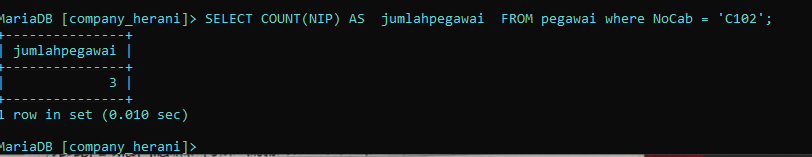

# Membuat Database
1. Membuat database pada cmd
	code 
 ```sql
 CREATE DATABASE company_herani;
 ```

    
  analisis 
  - ``create database`` : digunakan untuk membuat database pada mysql yang dapat menempung data.
  -  ``company_herani`` : adalah nama database yang digunakan pada mysql.
2. Menggunakan database
	code 
  ```sql
  USE company_herani;
  ```
  
    
  analisis
  - ``USE ``: digunakan ketika ingin menggunakan database.
  - ``[company_herani]`` adalah alamat database yang ingin digunakan 
  
# Membuat table 
code:
```sql
CREATE TABLE pegawai (
NIP int(3) AUTO_INCREMENT PRIMARY KEY NOT NULL,
NDep varchar(50) NOT NULL,
NBlk varchar(50),
jenis_kelamin enum('Laki-laki','Perempuan') NOT NULL,
alamat text(50) NOT NULL,
Telp varchar(20) NOT NULL,
jabatan enum('Manajer','Staf','Sales'),
Gaji BIGINT NOT NULL,
NoCab varchar(50) NOT NULL
);
```


analisis 
-  `create table` :  digunakan untuk membuat table pada database yang telah dibuat.
- Kolom `NIP` : kolom yang merupakan primary key yang akan diisi dan tidak boleh ada data yang sama, dengan tipe data `int(3)` dengan maksimal data 3 digit dan menggunakan fitur AUTO_INCREMENT.
- Kolom `NDep` : menyimpan data nama depan dengan tipe data `varchar(50)` dengan panjang data 50 karakter dan `NOT NULL ` yang bersifat wajib diisi.
-  Kolom `NBlk` : menyimpan data nama belakang dengan tipe data `varchar(50)` dengan panjang data 50 karakter dan  bersifat opsional / bisa tidak diisi.
- Kolom `jenis_kelamin` : menyimpan data jenis kelamin dengan tipe data `enum` digunakan untuk mendefinisikan sekumpulan nilai yang mewakili status atau kondisi tertentu dan bersifat `NOT NULL` yang bersifat wajib diisi.
- Kolom `alamat` : menyimpan data alamat dengan tipe data `text` 

# Menampilkan table 
code 
```sql
DESC pegawai;
```


analisis 
- ``desc ``: di gunakan untuk menampilkan tabel yang telah dibuat.
- ``pegawai ``: adalah nama tabel yang ingin di tampilkan.
# Memasukkan data 
 code 
 ```sql
 INSERT INTO pegawai value
 (data yang ingin di masukkan);
```


analisis 
- `INSERT INTO` :  di gunakan untuk memasukkan data pada tabel.
- `pegawai` : adalah nama tabel yang ingin di masukkan datanya.
-  `VALUE`:  di gunakan untuk data yang di masukkan. 

# Menampilkan data 
1. Menampilkan seluruh data pada table 
	code
	```sql
	SELECT * FROM pegawai;
	```

   
   
   analisis 
  - `SELECT` : di gunakan untuk menampilkan data yang sudah di masukkan.
   - ``* ``:  di gunakan untuk memilih semua kolom yang ada dalam tabel tertentu.
   - `FROM`:  adalah alamat tabel yang ingin di tampilkan.
   - `pegawai`:  adalah nama tabel yang ingin di tampilkan.
2. Menampilkan jumlah pegawai dan jabatan
   code
   ```sql
   SELECT COUNT(NIP) AS jumlahpegawai, COUNT(jabatan) AS jumlahjabatan FROM pegawai;
   ```

   
   
   ANALISIS :
   - `SELECT ` : digunakan untuk menentukan kolom apa yang ingin tampilkan dalam hasil query.
   - `COUNT(NIP)` : digunakanuntuk menghitung jumlah baris dalam tabel `pegawai` yang di mana `(NIP)` berfungsi menghitung  jumlah baris yang ada di dalamnya. 
   - `AS jumlahpegawai` : Hasil perhitungan diberi nama `jumlahpegawai`, yang menjelaskan bahwa ini adalah jumlah total pegawai.
   - `COUNT(jabatan)` : digunakan untuk menghitung jumlah baris dalam tabel `pegawai` yang dimana `(jabatan)` berfungsi untuk menghitung jumlah baris yang ada didalamnya. 
   - `AS jumlahjabatan` :   digunakan untuk menghitung jumlah baris dalam tabel `pegawai`.
   - `FROM pegawai` : digunakan untuk menentukan tabel yang akan diambil, data diambil dari tabel `pegawai`.
3. Menghitung jumlah baris data pada table NoCab 'C102'
   code 
   ```sql
   SELECT COUNT(NIP) AS jumlahpegawai
   FROM pegawai WHERE NoCab = 'C102';
   ```

   

   Analisis : 
  - `SELECT` : digunakan untuk menentukan kolom apa yang ingin tampilkan dalam hasil query. 
  - `COUNT(NIP)` :  digunakan untuk menghitung jumlah kolom pada tabel `pegawai`  yang di mana `(NIP)` berfungsi menghitung  jumlah baris yang ada di dalamnya. 
  - `AS jumlahpegawai` : Hasil perhitungan diberi nama `jumlahpegawai`, yang menjelaskan bahwa ini adalah jumlah total pegawai.
  - `FROM pegawai` : digunakan untuk menunjukkan dari tabel mana data tersebut diambil, data diambil dari tabel `pegawai`.
  - `WHERE NoCab = 'C102'` :  digunakan untuk menyeleksi data pada baris dalam tabel `pegawai` yang memilki data `NoCab` sama dengan `C102` yang akan dihitung. 
4. Mengelompokkan data 
   code
   ```sql
   SELECT NoCab, COUNT(NIP) AS jumlah_pegawai
   FROM pegawai GROUP BY NoCab;
   ```
   

   Analisis:
   - `SELECT NoCab`  : digunakan untuk menentukan kolom `NoCab`  yang ingin  tampilkan dalam hasil query.
   - ` COUNT(NIP)` : digunakan untuk menghitung jumlah kolom pada tabel `pegawai`  yang di mana `(NIP)` berfungsi menghitung  jumlah baris yang ada di dalamnya. 
   -  `AS jumlah_pegawai` : Hasil perhitungan diberi nama `jumlah_pegawai`, yang menjelaskan bahwa ini adalah jumlah total pegawai.
   - `FROM pegawai` : digunakana untuk menunjukkan dari tabel mana data tersebut diambil, data diambil dari tabel `pegawai`. 
   - `GROUP BY NoCab` : digunakan untuk mengelompokkan hasil berdasarkan kolom `NoCab`. yang dimana akan dihitung jumlah pegawai (`jumlah_pegawai`) untuk setiap cabang.

5. Menampilkan suatu kelompok data dengan menentukan kondisi yang dipenuhi
   code 
   ```sql
   SELECT NoCab, COUNT(NIP) AS jumlah_pegawai 
   FROM pegawai GROUP BY NoCab HAVING COUNT(NIP) >= 3;
   ```

   

   Analisis : 
   - `SELECT NoCab` : digunakan untuk menentukan kolom `NoCab`  yang ingin tampilkan dalam hasil query.
   - `COUNT(NIP)` :  digunakan untuk menghitung jumlah kolom pada tabel `pegawai`  yang di mana `(NIP)` berfungsi menghitung  jumlah baris yang ada di dalamnya. 
   - `AS jumlah_pegawai` : Hasil perhitungan diberi nama `jumlah_pegawai`, yang menjelaskan bahwa ini adalah jumlah total pegawai.
   - `FROM pegawai ` : digunakana untuk menunjukkan dari tabel mana data tersebut diambil, data diambil dari tabel `pegawai`.
   - `GROUP BY NoCab` : digunakan untuk mengelompokkan hasil berdasarkan kolom `NoCab`. yang dimana akan dihitung jumlah pegawai (`jumlah_pegawai`) untuk setiap cabang.
   - `HAVING COUNT(NIP) >= 3` :  digunakan untuk memfilter hasil dari grup yang sudah dibentuk oleh `GROUP BY`. Dalam hal ini  grup-grup tersebut akan disaring dan hanya menampilkan cabang-cabang di mana jumlah pegawai (`jumlah_pegawai`) sama dengan atau lebih dari 3. 
6. Menampilkan suatu data yang telah di jumlahkan 
   code 
  ```sql
  SELECT SUM(Gaji) AS total_gaji
  FROM pegawai;
  ```

    

   Analisis : 
   - `SELECT` : digunakan untuk menentukan kolom apa  yang ingin  tampilkan dalam hasil query.
   - `SUM(Gaji) ` :  digunakan untuk menghitung jumlah total dari nilai-nilai yang ada dalam kolom `Gaji`.
   - `AS total_gaji` : Hasil perhitungan diberi nama `total_gaji`, yang menjelaskan bahwa ini adalah jumlah total  gaji pegawai.
   - `FROM pegawai` : digunakana untuk menunjukkan dari tabel mana data tersebut diambil, data diambil dari tabel `pegawai`.
7. Menampilkan data gaji yang telah di jumlahkan pada jabatan 'Manajer' 
   code 
  ```sql
  SELECT SUM(Gaji) AS gaji_manajer
  FROM pegawai WHERE jabatan = 'Manajer' ; 
  ```

  

  Analisis : 
 - `SELECT` : digunakan untuk menentukan kolom apa  yang ingin  tampilkan dalam hasil query.
 - `SUM(Gaji) ` :  digunakan untuk menghitung jumlah total dari nilai-nilai yang ada dalam kolom `Gaji`.
 - `AS total_gaji` : Hasil perhitungan diberi nama `total_gaji`, yang menjelaskan bahwa ini adalah jumlah total  gaji pegawai.
 - `FROM pegawai` : digunakana untuk menunjukkan dari tabel mana data tersebut diambil, data diambil dari tabel `pegawai`.
 - `WHERE ` : digunakan untuk memfilter data sehingga hanya baris-baris yang memenuhi kondisi tertentu yang akan dihitung.
  - `jabatan = 'Manajer'` : hanya baris yang memiliki nilai `jabatan` sama dengan `'Manajer'` yang akan disertakan dalam perhitungan.
8. Menampilkan data gaji yang sudah di kelompokkan berdasarkan 'NoCab'
   code 
   ```sql
   SELECT NoCab, SUM(Gaji) AS Total_gaji
   FROM pegawai GROUP BY NoCab;
  ```

  

 Analisis : 
 - `SELECT NoCab` :  digunakan untuk menentukan kolom yang akan ditampilkan dalam hasil query. Yang dimana data yang akan ditampilkan adalah NoCab yang menjadi dasar pengelompokan data.
 - `SUM(Gaji`) : digunakan untuk menjumlahkan nilai dalam kolom `Gaji` untuk setiap kelompok `NoCab`. 
 - `AS Total_gaji` : Hasil perhitungan diberi nama `total_gaji`, yang menjelaskan bahwa ini adalah jumlah total  gaji pegawai.
 - `FROM pegawai` : digunakana untuk menunjukkan dari tabel mana data tersebut diambil, data diambil dari tabel `pegawai`.
 - `GROUP BY NoCab` : digunakan untuk mengelompokkan data berdasarkan kolom `NoCab`
9. Menampilkan data gaji yang telah di kelompokkan berdasarkan gaji '>= 8000000' 
   code 
   ```sql
   SELECT NoCab, SUM(Gaji) AS Total_gaji
   FROM pegawai GROUP BY NoCab HAVING SUM(Gaji) >= 8000000;
   ```

   

   Analisis : 
   - `SELECT NoCab` : digunakan untuk menentukan kolom yang akan ditampilkan dalam hasil query. Yang dimana data yang akan ditampilkan adalah NoCab yang menjadi dasar pengelompokan data.
   - `SUM(Gaji)` : digunakan untuk menjumlahkan nilai dalam kolom `Gaji` untuk setiap kelompok `NoCab`. 
   - `AS Total_gaji` :  Hasil perhitungan diberi nama `total_gaji`, yang menjelaskan bahwa ini adalah jumlah total  gaji pegawai.
   - `FROM pegawai` : digunakana untuk menunjukkan dari tabel mana data tersebut diambil, data diambil dari tabel `pegawai`.
   - `GROUP BY NoCab` : digunakan untuk mengelompokkan data berdasarkan kolom `NoCab`
   - `HAVING SUM(Gaji) >= 8000000` : digunakan untuk memfilter hasil yang telah dikelompokkan oleh `GROUP BY`. `SUM(Gaji)>= 8000000` menyaring kelompok-kelompok yang hanya memiliki total gaji (Total_gaji) sebesar 8.000.000 atau lebih. 
10. Menampilkan Rata-rata gaji pegawai
   code
   ```sql
   SELECT AVG(Gaji) AS Rata_rata FROM pegawai;
  ```

   

   Analisis : 
   - `SELECT` : digunakan untuk menentukan kolom mana yang ingin ditampilkan dalam hasil.
   - `AVG(Gaji)` : `AVG()` adalah fungsi agregat dalam SQL yang digunakan untuk menghitung rata-rata dari nilai-nilai dalam kolom yang ditentukan. `Gaji` adalah kolom yang berisi nilai gaji dari setiap pegawai.
   - `AS rata_rata` : Hasil perhitungan diberi nama `rata_rata`, yang menjelaskan bahwa ini adalah jumlah Rata-rata gaji pegawai.
   - `FROM pegawai` : digunakana untuk menunjukkan dari tabel mana data tersebut diambil, data diambil dari tabel `pegawai`.
11. Menampilkan Rata-rata gaji yang telah di jumlahkan pada jabatan 'Manajer' 
   code 
   ```sql
  SELECT AVG(Gaji) AS GajiRataMgr
  FROM pegawai 
  WHERE jabatan = 'Manajer';   
  ```

  

  Analisis: 
  - `SELECT` : digunakan untuk menentukan kolom mana yang ingin ditampilkan dalam hasil.
  - `AVG(Gaji)` : `AVG()` adalah fungsi agregat dalam SQL yang digunakan untuk menghitung rata-rata dari nilai-nilai dalam kolom yang ditentukan.  `Gaji` adalah kolom yang berisi nilai gaji dari setiap pegawai.
  - `AS GajiRataMgr` : Hasil perhitungan diberi nama `GajiRataMgr`, yang menjelaskan bahwa ini adalah jumlah Rata-rata gaji pada jabatan `Manajer`.
  - `FROM pegawai` : digunakana untuk menunjukkan dari tabel mana data tersebut diambil, data diambil dari tabel `pegawai`.
  - `WHERE jabatan = 'Manajer'` : digunakan untuk menyaring data yang akan diproses berdasarkan kondisi tertentu. Kondisi ini menyaring data sehingga hanya baris yang memiliki nilai jabatan sama dengan 'Manajer'.
 
12. Menampilkan rata-rata gaji yang sudah di kelompokkan berdasarkan 'NoCab'
   code 
   ```sql
  SELECT NoCab, AVG(Gaji) AS Rata_Gaji
  FROM pegawai GROUP BY NoCab;
  ```

  

  Analisis : 
  - `SELECT NoCab` : digunakan untuk menentukan kolom yang akan ditampilkan dalam hasil query. Yang dimana data yang akan ditampilkan adalah NoCab yang menjadi dasar pengelompokan data.
  - `AVG(Gaji)` : `AVG()` adalah fungsi agregat dalam SQL yang digunakan untuk menghitung rata-rata dari nilai-nilai dalam kolom yang ditentukan.  `Gaji` adalah kolom yang berisi nilai gaji dari setiap pegawai.
  - `AS Rata_Gaji` : Hasil perhitungan diberi nama `Rata_Gaji`, yang menjelaskan bahwa ini adalah jumlah Rata-rata gaji pegawai.
  - `FROM pegawai` : digunakana untuk menunjukkan dari tabel mana data tersebut diambil, data diambil dari tabel `pegawai`.
  - `GROUP BY NoCab` : digunakan untuk mengelompokkan data berdasarkan kolom `NoCab`
13. Menampilkan rata-rata gaji yang sudah di kelompokkan berdasarkan 'NoCab' C101 dan C102
   Code
   ```sql
   SELECT NoCab, AVG(Gaji) AS Rata_Gaji
   FROM pegawai GROUP BY NoCab HAVING NoCab = 'C101' OR NoCab = 'C102';
  ```

  

  ANALISIS : 
  - `SELECT NoCab` : digunakan untuk menentukan kolom yang akan ditampilkan dalam hasil query. Yang dimana data yang akan ditampilkan adalah NoCab yang menjadi dasar pengelompokan data.
  - `AVG(Gaji)` : `AVG()` adalah fungsi agregat dalam SQL yang digunakan untuk menghitung rata-rata dari nilai-nilai dalam kolom yang ditentukan.  `Gaji` adalah kolom yang berisi nilai gaji dari setiap pegawai.
  - `AS Rata_Gaji` : Hasil perhitungan diberi nama `Rata_Gaji`, yang menjelaskan bahwa ini adalah jumlah Rata-rata gaji pegawai.
  - `FROM pegawai` : digunakana untuk menunjukkan dari tabel mana data tersebut diambil, data diambil dari tabel `pegawai`.
  - `GROUP BY NoCab` : digunakan untuk mengelompokkan data berdasarkan kolom `NoCab`
  - `HAVING NoCab = 'C101' OR NoCab = 'C102'` : digunakan untuk menyaring data setelah pengelompokan Kondisi untuk menyaring hasil sehingga hanya cabang dengan nomor `C101` atau `C102` yang ditampilkan dalam hasil.
14. Menampilkan Gaji terbesar dan terkecil pada pegawai
   code 
   ```sql
  SELECT MAX(Gaji) AS Gaji_Terbesar, MIN(Gaji) AS Gaji_Terkecil
  FROM pegawai;
  ```

   

   Analisis: 
   - `SELECT` : digunakan untuk menentukan kolom mana yang ingin ditampilkan dalam hasil.
   - `MAX(Gaji)` : `MAX()` digunakan untuk menemukan nilai maksimum (nilai terbesar) dari kolom. `Gaji` adalah kolom yang berisi nilai gaji dari setiap pegawai.
   - `AS Gaji_Terbesar` : Hasil perhitungan diberi nama `Gaji_Terbesar`, yang menjelaskan bahwa ini adalah maksimum atau nilai terbesar gaji pada kolom pegawai.
   - `MIN(Gaji)` : `MIN()` digunakan untuk menentukan nilai minimum atau nilai terkecil dari kolom. `Gaji` adalah kolom yang berisi nilai gaji dari setiap pegawai.
   - `AS Gaji_Terkecil` : Hasil perhitungan diberi nama `Gaji_Terkecil`, yang menjelaskan bahwa ini adalah minimum atau nilai terkecil gaji pada kolom pegawai.
   - `FROM pegawai` : digunakana untuk menunjukkan dari tabel mana data tersebut diambil, data diambil dari tabel `pegawai`.
15. Menampilkan Gaji terbesar dan terkecil yang telah di kelompokkan berdasarkan jabatan 'Manajer'
   code 
   ```sql
  SELECT MAX(Gaji) AS Gaji_Terbesar, MIN(Gaji) AS Gaji_Terkecil
  FROM pegawai WHERE jabatan = 'Manajer' ;
  ```

   
  ANALISIS: 
 - `SELECT` : digunakan untuk menentukan kolom mana yang ingin ditampilkan dalam hasil.
 - `MAX(Gaji)` : `MAX()` digunakan untuk menemukan nilai maksimum (nilai terbesar) dari kolom. `Gaji` adalah kolom yang berisi nilai gaji dari setiap pegawai.
 - `AS Gaji_Terbesar` : Hasil perhitungan diberi nama `Gaji_Terbesar`, yang menjelaskan bahwa ini adalah maksimum atau nilai terbesar gaji pada kolom pegawai.
 - `MIN(Gaji)` : `MIN()` digunakan untuk menentukan nilai minimum atau nilai terkecil dari kolom. `Gaji` adalah kolom yang berisi nilai gaji dari setiap pegawai.
 - `AS Gaji_Terkecil` : Hasil perhitungan diberi nama `Gaji_Terkecil`, yang menjelaskan bahwa ini adalah minimum atau nilai terkecil gaji pada kolom pegawai.
 - `FROM pegawai` : digunakana untuk menunjukkan dari tabel mana data tersebut diambil, data diambil dari tabel `pegawai`.
 - `WHERE jabatan = 'Manajer' ` : digunakan untuk menyaring data yang akan diproses berdasarkan kondisi tertentu. Kondisi ini menyaring data sehingga hanya baris yang memiliki nilai jabatan sama dengan 'Manajer'.
16. Menampilkan Gaji terbesar dan terkecil yang telah di kelompokkan berdasarkan 'NoCab' 
  code 
  ```sql
  SELECT MAX(Gaji) AS Gaji_Terbesar, MIN(Gaji) AS Gaji_Terkecil
  FROM pegawai GROUP BY NoCab;
  ```

   Analisis : 
  - `SELECT` : digunakan untuk menentukan kolom mana yang ingin ditampilkan dalam hasil.
  - `MAX(Gaji)` : `MAX()` digunakan untuk menemukan nilai maksimum (nilai terbesar) dari kolom. `Gaji` adalah kolom yang berisi nilai gaji dari setiap pegawai.
  - `AS Gaji_Terbesar` : Hasil perhitungan diberi nama `Gaji_Terbesar`, yang menjelaskan bahwa ini adalah maksimum atau nilai terbesar gaji pada kolom pegawai.
  - `MIN(Gaji)` : `MIN()` digunakan untuk menentukan nilai minimum atau nilai terkecil dari kolom. `Gaji` adalah kolom yang berisi nilai gaji dari setiap pegawai.
  - `AS Gaji_Terkecil` : Hasil perhitungan diberi nama `Gaji_Terkecil`, yang menjelaskan bahwa ini adalah minimum atau nilai terkecil gaji pada kolom pegawai.
  - `FROM pegawai` : digunakana untuk menunjukkan dari tabel mana data tersebut diambil, data diambil dari tabel `pegawai`.
  - `GROUP BY NoCab` : digunakan untuk mengelompokkan data berdasarkan kolom `NoCab`
17. Menampilkan Gaji terbesar dan terkecil yang hasil hitungannya lebih dari atau sama dengan 3
   code 
   ```sql
  SELECT MAX(Gaji) AS Gaji_Terbesar, MIN(Gaji) AS Gaji_Terkecil
  FROM pegawai GROUP BY NoCab HAVING COUNT(NIP) >= 3; 
  ```

  

  Analisis : 
  - `SELECT` : digunakan untuk menentukan kolom mana yang ingin ditampilkan dalam hasil.
  - `MAX(Gaji)` : `MAX()` digunakan untuk menemukan nilai maksimum (nilai terbesar) dari kolom. `Gaji` adalah kolom yang berisi nilai gaji dari setiap pegawai.
  - `AS Gaji_Terbesar` : Hasil perhitungan diberi nama `Gaji_Terbesar`, yang menjelaskan bahwa ini adalah maksimum atau nilai terbesar gaji pada kolom pegawai.
  - `MIN(Gaji)` : `MIN()` digunakan untuk menentukan nilai minimum atau nilai terkecil dari kolom. `Gaji` adalah kolom yang berisi nilai gaji dari setiap pegawai.
  - `AS Gaji_Terkecil` : Hasil perhitungan diberi nama `Gaji_Terkecil`, yang menjelaskan bahwa ini adalah minimum atau nilai terkecil gaji pada kolom pegawai.
  - `FROM pegawai` : digunakana untuk menunjukkan dari tabel mana data tersebut diambil, data diambil dari tabel `pegawai`.
  - `GROUP BY NoCab` : digunakan untuk mengelompokkan data berdasarkan kolom `NoCab`
  - `HAVING COUNT(NIP) >= 3` : digunakan untuk menyaring kelompok hasil setelah proses `GROUP BY`. `COUNT(NIP)` yang digunakan untuk menghitung jumlah baris dalam setiap kelompok yang memiliki nilai `NIP` kondisi ` >= 3` berarti hanya yang memiliki tiga atau lebih pegawai yang akan ditampilkan dalam hasil.
18. Menampilkan MAX, MIN, SUM, AVG dan total pegawai pada tabel
   code 
   ```sql
   SELECT COUNT(NIP) AS jumlahpegawai, SUM(Gaji) AS TotalGaji,
   AVG(Gaji) AS RataGaji, MAX(Gaji) AS GajiMaks, MIN(Gaji) AS GajiMin
   FROM pegawai;
  ```

  

  ANALISIS : 
  - `SELECT` : digunakan untuk menentukan kolom mana yang ingin ditampilkan dalam hasil.
  - `COUNT(NIP)` : digunakan untuk menghitung jumlah kolom pada tabel `pegawai`  yang di mana `(NIP)` berfungsi menghitung  jumlah baris yang ada di dalamnya. 
  - `AS jumlahpegawai` : Hasil perhitungan diberi nama `jumlahpegawai`, yang menjelaskan bahwa ini adalah jumlah total pegawai.
  - `SUM(Gaji)` :  digunakan untuk menghitung jumlah total dari nilai-nilai yang ada dalam kolom `Gaji`.
  - `AS TotalGaji` : Hasil perhitungan diberi nama `TotalGaji`, yang menjelaskan bahwa ini adalah jumlah total  gaji pegawai.
  - `AVG(Gaji)` : `AVG()`  digunakan untuk menghitung rata-rata dari nilai-nilai dalam kolom yang ditentukan.  `Gaji` adalah kolom yang berisi nilai gaji dari setiap pegawai.
  - `AS RataGaji` : Hasil perhitungan diberi nama `RataGaji`, yang menjelaskan bahwa ini adalah jumlah Rata-rata gaji pegawai.
  - `MAX(Gaji)` : `MAX()` digunakan untuk menemukan nilai maksimum (nilai terbesar) dari kolom. `Gaji` adalah kolom yang berisi nilai gaji dari setiap pegawai.
  - `AS GajiMaks` : Hasil perhitungan diberi nama `GajiMaks`, yang menjelaskan bahwa ini adalah maksimum atau nilai terbesar gaji pada kolom pegawai.
  - `MIN(Gaji)` : `MIN()` digunakan untuk menentukan nilai minimum atau nilai terkecil dari kolom. `Gaji` adalah kolom yang berisi nilai gaji dari setiap pegawai.
  - `AS GajiMin` : Hasil perhitungan diberi nama `Gaji_Terkecil`, yang menjelaskan bahwa ini adalah minimum atau nilai terkecil gaji pada kolom pegawai.
  - `FROM pegawai` :  digunakana untuk menunjukkan dari tabel mana data tersebut diambil, data diambil dari tabel `pegawai`.
19. Menampilkan MAX, MIN, SUM, AVG dan total pegawai dari jabatan `Staf` dan `Sales` 
  code
  ```sql
   SELECT COUNT(NIP) AS jumlahpegawai, SUM(Gaji) AS TotalGaji,
   AVG(Gaji) AS RataGaji, MAX(Gaji) AS GajiMaks, MIN(Gaji) AS GajiMin
   FROM pegawai 
   WHERE jabatan = 'Staf'  OR jabatan = 'Sales'
   GROUP BY NoCab HAVING SUM(Gaji) <= 2600000;
 ```

 

 analisis: 
  -  `SELECT` : digunakan untuk menentukan kolom mana yang ingin ditampilkan dalam hasil.
  - `COUNT(NIP)` : digunakan untuk menghitung jumlah kolom pada tabel `pegawai`  yang di mana `(NIP)` berfungsi menghitung  jumlah baris yang ada di dalamnya. 
  - `AS jumlahpegawai` : Hasil perhitungan diberi nama `jumlahpegawai`, yang menjelaskan bahwa ini adalah jumlah total pegawai.
  - `SUM(Gaji)` :  digunakan untuk menghitung jumlah total dari nilai-nilai yang ada dalam kolom `Gaji`.
  - `AS TotalGaji` : Hasil perhitungan diberi nama `TotalGaji`, yang menjelaskan bahwa ini adalah jumlah total  gaji pegawai.
  - `AVG(Gaji)` : `AVG()`  digunakan untuk menghitung rata-rata dari nilai-nilai dalam kolom yang ditentukan.  `Gaji` adalah kolom yang berisi nilai gaji dari setiap pegawai.
  - `AS RataGaji` : Hasil perhitungan diberi nama `RataGaji`, yang menjelaskan bahwa ini adalah jumlah Rata-rata gaji pegawai.
  - `MAX(Gaji)` : `MAX()` digunakan untuk menemukan nilai maksimum (nilai terbesar) dari kolom. `Gaji` adalah kolom yang berisi nilai gaji dari setiap pegawai.
  - `AS GajiMaks` : Hasil perhitungan diberi nama `GajiMaks`, yang menjelaskan bahwa ini adalah maksimum atau nilai terbesar gaji pada kolom pegawai.
  - `MIN(Gaji)` : `MIN()` digunakan untuk menentukan nilai minimum atau nilai terkecil dari kolom. `Gaji` adalah kolom yang berisi nilai gaji dari setiap pegawai.
  - `AS GajiMin` : Hasil perhitungan diberi nama `Gaji_Terkecil`, yang menjelaskan bahwa ini adalah minimum atau nilai terkecil gaji pada kolom pegawai.
  - `FROM pegawai` :  digunakana untuk menunjukkan dari tabel mana data tersebut diambil, data diambil dari tabel `pegawai`.
  - `WHERE jabatan = 'Staf'  OR jabatan = 'Sales'` :  `WHERE ` adalah kondisi yang harus di penuhi oleh suatu kolom. `jabatan = 'Staf'  OR jabatan = 'Sales'` adalah kondisi dari `WHERE` yang dimana hanya jabatan `staf` atau `sales` yang salah satunya terpenuhi agar bisa tampil.
  - `GROUP BY NoCab HAVING SUM(Gaji) <= 2600000` : `GROUP BY ` digunakan untuk mengelompokkan data sesuai dengan kolom yang dipilih. `NoCab` adalah nama kolom yang akan dikelompokkan datanya. `HAVING` adalah suatu kondisi yang harus dipenuhi agar data bisa di tampilkan . `SUM(Gaji) <= 2600000` kondisi dari `HAVING` hasil  data yang dijumlah gajinya kurang dari atau sama dengan `2600000` yang bisa tampil.
