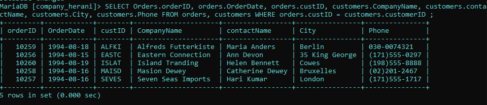
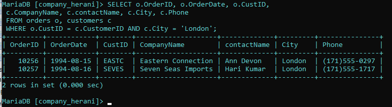
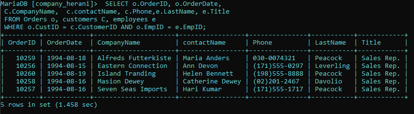
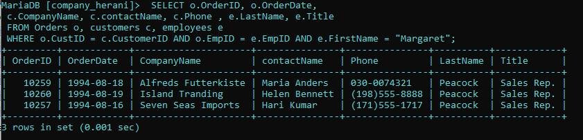
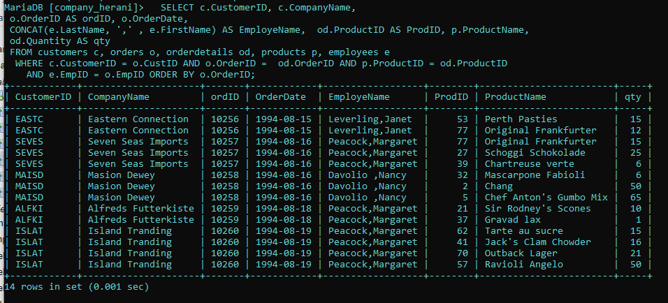
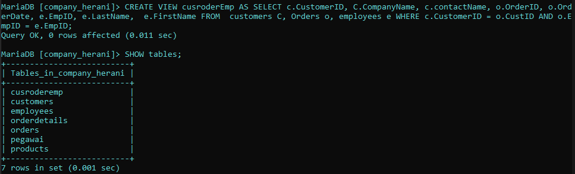
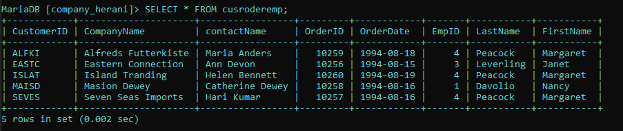
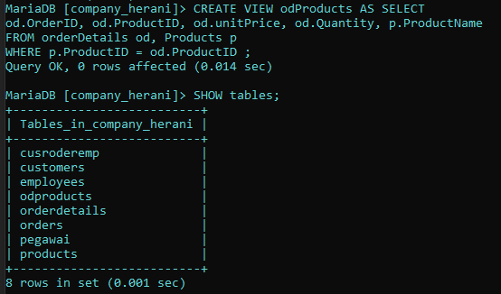
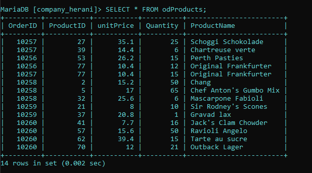
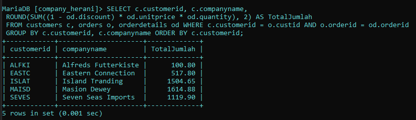

1. Menampilkan data yang tabelnya terpisah-pisah
 ``` sql
 SELECT orders.OrderID, orders.OrderDate, orders.custID, customers.CompanyName,
 customers.contactName, customers.City, customers.Phone FROM orders, customers
 WHERE orders.custID = customers.customerID ;
 ```
  hasil:  penjelasan: 
 - `SELECT` : digunakan untuk menentukan kolom mana yang ingin ditampilkan dalam hasil.
 - `Orders.orderID` : orders merupakan nama tabel yang ingin di tampilkan kolomnya yaitu orderID. Jadi kolom orderID dalam table order ingin di tampilkan 
 - `orders.OrderDate` : kolom orderDate dalam table orders ingin di tampilkan 
 - `orders.custID`: custID dalam tabel orders di pilih untuk di tampilkan 
 - `customers.CompanyName`: kolom CompanyName dalam tabel customer dipilih untuk di tampilkan. 
 - `customers.contactName`: kolom contactName dalam tabel customer di pilih untuk di tampilkan. 
 - `customers.City` : kolom City dalm tabel customer dipilih untuk di tampilkan.
 - `customers.Phone`: kolom phone dalam tabel customers di pilih untuk di tampilkan.
 - `FROM orders, customers` : untuk memilih dari tabel mana saja yang kolomnya ingin di pilih untuk di tampilkan. orders adalah nama tabel pertama yang dipilih dan customers adalah nama tabel kedua yang dipilih.
 - `WHERE` :  kondisi yang harus di penuhi oleh suatu data agar bisa ditampilkan.
 - `orders.custID = customers.customerID` : kondisi dari where yang harus di penuhi. Jadi, data pada kolom custID dalam tabel orders harus sama dengan data pada kolom customersID dalam tabel customer agar masing-masing datanya bisa di tampilkan 

2. Menampilkan data yang di mana hanya ada data yang beribukota London
 ```sql
 SELECT o.OrderID, o.OrderDate, o.CustID,
 c.CompanyName, c.contactName, c.City, c.Phone,
 FROM orders o, customers c
 WHERE o.CustID = c.CustomerID AND c.City = 'London';
 ```
 hasil: 
 penjelasan: 
  - `SELECT` : untuk memilih kolom mana saja yang ingin di tampilkan dari tabel mana kolom tersebut di ambil. 
  - `o.OrderID` : o merupakan singkatan dari tabel orders. Kolom orderID merupakan kolom dari table orders yang di pilih untuk di tampilkan.  
  - `o.OrderDate` : Kolom orderDate merupakan kolom dari tabel o yaitu orders yang dipilih untuk ditampilkan.
  - `o.CustID` : Kolom CustID merupakan kolom dari tabel o yaitu orders yang dipilih untuk ditampilkan.
  - `C.CompanyName` : c merupakan singkatan dari tabel customers. Kolom companyName merupakan kolom dari tabel customers yang dipilih untuk ditampilkan.
  - `C.contactName` : Kolom contactName merupakan kolom dari tabel c yaitu customer yang dipilih untuk ditampilkan.
  - `C.City` : Kolom City merupakan kolom dari tabel c yaitu customer yang dipilih untuk ditampilkan.
  - `C.Phone` : Kolom phone merupakan kolom dari tabel c yaitu customer yang dipilih untuk ditampilkan.
  - `FROM orders o, customers c` : untuk memilih dari tabel c yaitu customers yang dipilih untuk di tampilkan. orders adalah nama tabel yang dipilih untuk ditampilkan tapi disingkat jadi o, agar lebih mudah dan cepat. customer adalah nama tabel yang dipilih untuk di tampilkan tapi di singkat jadi c
  - ` WHERE` : kondisi yang harus di penuhi oleh suatu kolom data agar bisa ditampilkan 
  - `o.CustID = o.CustomerID AND o.City = 'London'` : data pada kolom CustID dalam tabel o(orders) harus sama dengan data pada kolom customerID pada tabel c(customer). `AND` untuk menyeleksi dua data atau lebih pada perintah WHERE. `o.City = 'London'` adalah kondisi tambahan yang dipenuhi juga pada kolom city dari tabel c (customers) datanya harus berisi data "London" agar bisa ditampilkan.
  
3. Menampilkan data yang dimana datanya sama dengan data table yang telah relasi
 ```sql
 SELECT o.OrderID, o.OrderDate, C.CompanyName, 
 c.contactName, c.Phone,e.LastName, e.Title 
 FROM Orders o, customers C, employees e
 WHERE o.CustID = c.CustomerID AND o.EmpID = e.EmpID;
 ```
   hasil: 
   penjelasan: 
   - `SELECT` : untuk memilih kolom mana saja yang ingin di tampilkan dari tabel mana kolom tersebut di ambil. 
   - `o.OrderID, o.OrderDate` : Kolom orderID dan orderDate dari tabel o(orders) di pilih untuk di tampilkan.
   - `C.CompanyName, c.contactName, c.Phone ` :  Kolom-kolom companyName, contactName dan Phone dari tabel c(customers) dipilih untuk ditampilkan.
   - `e.LastName, e.Title ` : kolom LastName dan Title dari tabel e( employees ) dipilih untuk ditampilkan. 
   - `FROM Orders o, customers C, employees e` : untuk memilih dari tabel mana saja yang kolomnya dipilih untuk ditampilkan . Orders disingkat jadi c adalah nama tabel yang dipilih, employees disingkat jadi e adalah nama tabel yang dipilih untuk di tampilkan. 
   - `WHERE` : kondisi yang di harus di penuhi oleh suatu data untuk di tampilkan. 
   - `o.CustID = c.CustomerID AND o.EmpID = e.EmpID` : data pada kolom CustID dalam tabel o (orders) harus sam dengan data pada kolom CustomerID pada tabel c (customers). `AND` untuk menyeleksi dua data atau lebih pada perintah WHERE. `o.EmpID = e.EmpID` data pada kolom EmpID dalam tabel o (orders) harus sama dengan data pada kolom EmpID dalam tabel e (employees).
4. Menampilkan data yang datanya terdapat nama Margaret
 ```sql
 SELECT o.OrderID, o.OrderDate, 
 c.CompanyName, c.contactName, c.Phone
 , e.LastName, e.Title
 FROM Orders o, customers c, employees e
 WHERE o.CustID = c.CustomerID AND o.EmpID = e.EmpID 
 AND e.FirstName = 'Margaret';
 ```
 hasil: 
 penjelasan: 
 - `SELECT` : untuk memilih kolom mana saja yang ingin di tampilkan dari tabel mana kolom tersebut di ambil. 
 - `o.OrderID, o.OrderDate,` : Kolom orderID dan orderDate dari tabel o(orders) di pilih untuk di tampilkan
 - `c.CompanyName, c.contactName, c.Phone` : Kolom-kolom companyName, contactName dan Phone dari tabel c(customers) dipilih untuk ditampilkan.
 - `e.Title, e.LastName` : kolom LastName dan Title dari tabel e( employees ) dipilih untuk ditampilkan. 
 - `FROM Orders o, customers C, employees e` :  untuk memilih dari tabel mana saja yang kolomnya dipilih untuk ditampilkan . Orders disingkat jadi c adalah nama tabel yang dipilih, employees disingkat jadi e adalah nama tabel yang dipilih untuk di tampilkan. 
 - `WHERE o.CustID = c.CustomerID AND o.EmpID = e.EmpID e.FirsName = 'Margaret'` : `WHERE`  kondisi yang di harus di penuhi oleh suatu data untuk di tampilkan. `o.CustID = c.CustomerID`  data pada kolom CustID dalam tabel o (orders) harus sam dengan data pada kolom CustomerID pada tabel c (customers). `AND` untuk menyeleksi dua data atau lebih pada perintah WHERE.  `e.FirsName = 'Margaret'` data pada kolom First name dalam tabel e (employees) harus berisi data "margaret" agar bisa tampil.
5. Menampilkan data yang telah di urutkan
  ```sql
 SELECT c.CustomerID, c.CompanyName, o.OrderID,
 o.OrderDate, od.ProductID, od.Quantity, od.unitPrice
 p.ProductName, od.Quantity AS Qty
 FROM customers c, Orders o, orderdetails od, Products p
 WHERE c.CustomerID = o.custID AND o.OrderID = od.OrderID
 AND p.ProductID = od.ProductID ORDER BY c.CustomerID;
 ```
 hasil:  
 penjelasan: 
  - `SELECT` : untuk memilih kolom mana saja yang ingin di tampilkan dari tabel mana kolom tersebut di ambil. 
  - `c.CustomerID,c.CompanyName` : kolom customerID dan companyName dari tabel c (customers) dipilih untuk di tampilkan.
  - `o.OrderID, o.OrderDate` : kolom orderID dan OrderDate dari tabel o(order) dipilih untuk ditampilkan.
  - `od.ProductID, od.Quantity, od.unitPrice` : kolom productID, Quality, dan unitPrice dari tabel od(orderDetail) yang dipilih untuk di tampilkan. 
  - `p.ProductName` : kolom ProductName merupakan kolom dari tabel p(product) yang dipilih untuk ditampilkan.
  - `od.Quantity AS Qty` : kolom quantity di tampilkan sebagai nama sementaranya yaitu qty. `AS` untuk mengubah nama suatu kolom secara sementara. 
  - `FROM customers C, Orders o, Orderdetails od, Products p` : untuk memilih dari tabel mana saja yang kolomnya dipilih  untuk di tampilkan. customers atau c adalah nama tabel yang pilih untuk di tampilkan. order atau o adalah nama tabel yang ingin  di tampilkan. orderdetails atau od adalah nama tabel yang ingin di tampilkan. product atau p adalah nama tabel yang dipilih untuk ditampilkan.
  - `WHERE c.customerID = o.custID AND o.OrderID = od.OrderID AND p.ProductID = od.ProductID ORDER BY c.CustomerID` : `WHERE` kondisi yang di mana harus di penuhi agar bisa di tampilkan. `c.customerID = o.custID` data pada kolom customerID dari tabel customers atau c harus sama dengan data pada kolom CustID pada tabel orders atau o. `AND` untuk menyeleksi dua data atau lebih pada perintah WHERE. `p.ProductID = od.ProductID` data pada kolom ProductID harus sama dengan data pada kolom ProductID pada tabel orderDetails atau od. `ORDER BY c.CustomerID` untuk megurut data berdasarkan kolom customersID dari tabel costomers.
6. Menampilkan gabungan dari beberapa data menjadi satu
  ```sql
  SELECT c.CustomerID, c.CompanyName, o.OrderID AS ordID, o.OrderDate, 
  CONCAT(e.LastName, ',' , e.firstname) AS EmployeName,
  od.productID AS ProdID, p.ProductName, od.Quantity AS qty
  FROM customers c, orders o, orderdetails od, product p, employees e
  WHERE c.CustomerID = o.CustID AND OrderID =  od.OrderID AND p.ProductID =    od.ProductID AND e.EmpID = od.EmpID ORDER BY o.OrderID; 
  ```
  hasil:  
  penjelasan : 
   - `SELECT` : untuk memilih kolom mana saja yang ingin di tampilkan dari tabel mana kolom tersebut di ambil. 
   - `c.CustomerID, c.CompanyName` : kolom customerID dan companyName dari tabel c (customers) dipilih untuk di tampilkan.
   - `o.OrderID, o.OrderDate` : kolom orderID dan OrderDate dari tabel o(order) dipilih untuk ditampilkan.
   - `o.OrderID AS ordID, o.OrderDate` : kolom orderID dan Orderdate dari tabel o(orders) di pilih untuk ditampilkan. `AS` merupakan perintah untuk mengubah nama suatu kolom secara sementara
   - `CONCAT(e.LastName, ',' , e.firstname) AS EmployeName` : `CONCAT` adalah perintah untuk menggabungkan beberapa kolom data menjadi satu kolom data. `(e.LastName, ',' , e.firstname)` merupakan kolom-kolom yang ingin digabungkan. LastName dan FirstName adalah kolom dari tabel e(employees) yang ingin di gabung. `(',')` merupakan separator atau pemisah antara kedua kolom yang di gabung. AS employees untuk mengubah hasil CONCAT tadi menjadi employees(namanya) untuk sementara. 
   - `od.productID AS ProdID, od.Quantity AS Qty` : kolom productID  dan  quantity pada tabel od(orderdatails) dipilih untuk ditampilkan. kolom productID namanya diubah sementara menjadi prodID. kolom Quantity namanya di ubah sementara menjadi Qty.
   - `p.ProductName` : kolom productName dari tabel p(product) dipilih untuk ditampilkan. 
   - `FROM customers c, orders o, orderdetails od, products p, employees e` : untuk memilih dari tabel mana saja yang kolomnya dipilih  untuk di tampilkan. customers atau c adalah nama tabel yang pilih untuk di tampilkan. order atau o adalah nama tabel yang ingin  di tampilkan. orderdetails atau od adalah nama tabel yang ingin di tampilkan. product atau p adalah nama tabel yang dipilih untuk ditampilkan. employees atau e adalah nama tabel yang ingin ditampilkan.
   - `WHERE c.CustomerID = o.CustID AND o.OrderID = od.OrderID AND p.ProductID = od.ProductID AND e.EmpID = od.EmpID` : `WHERE` kondisi yang di mana harus di penuhi agar bisa di tampilkan. `c.customerID = o.custID` data pada kolom customerID dari tabel customers atau c harus sama dengan data pada kolom CustID pada tabel orders atau o. `AND` untuk menyeleksi dua data atau lebih pada perintah WHERE. `p.ProductID = od.ProductID` data pada kolom ProductID harus sama dengan data pada kolom ProductID pada tabel orderDetails atau od. `o.OrderID = od.OrderID` data pada kolom OrderID harus sama dengan data kolom OrderID pada orderdetails. `e.EmpID = od.EmpID` data pada kolom EmpID harus sama dengan  kolom EmpID pada tabel oderddetails.
   - ` ORDER BY o.OrderID` : `ORDER BY c.OrderID` untuk megurut data berdasarkan kolom OrderID dari tabel orders
   
7. Membuat tabel yang dimana datanya di ambil dari tabel yang sudah ada 
  ```sql
 CREATE VIEW cusroderEmp AS SELECT c.CustomerID, C.CompanyName,
 c.contactName, o.OrderID, o.OrderDate, e.EmpID, e.LastName, 
 e.FirstName FROM  customers C, Orders o, employees e
 WHERE c.CustomerID = o.CustID AND o.EmpID = e.EmpID ;

 SHOW tables 
 ```
 hasil: 
 
 ```sql
 SELECT * FROM cusroderEmp;
 ```
  hasil: 
  penjelasan: 
  -  `CREATE VIEW cusroderEmp` : merupakan tabel virtual yang dibuat dengan nama  cusroderEmp.
  - `AS SELECT` : untuk memilih kolom-kolom mana saja yang dipilih untuk di masukkan ke tabel virtual.
  - `c.CustomerID, C.CompanyName,c.contactName`: kolom customerID, CompanyName, dan contactName dari tabel c(customer) dipilih untuk di masukkan datanya ke dalam tabel virtual.
  - `o.OrderID, o.OrderDate` : kolom OrderID, OrderDate dari tabel o(order) dipilih untuk dimasukkan datanya ke dalam tabel virtual.
  - `e.EmpID, e.LastName, e.FirstName` : kolom EmpID, LastName, FirstName dari tabel e(employees) dipilih untuk dimasukkan datanya ke dalam tabel virtual.
  - `FROM  customers C, Orders o, employees e` : untuk memilih tabel mana saja yang kolomnya dipilih untuk dimasukkan. customer, employees, dan order merupakan nama tabel yang kolomnya dipilih.
  - `WHERE c.CustomerID = o.CustID AND o.EmpID = e.EmpID` : `WHERE` kondisi yan harus dipenuhi oleh suatu kolom yang agar dapat bisa dimasukkan ke dalam tabel virtual. `c.CustomerID = o.CustID` data pada kolom customerID dari tabel c(customers) harus sam dengan data pada kolom custID dari tabel o(order) agar bisa di masukkan. s
  
8.  Membuat tabel baru yang dimana datanya di ambil dari kolom yang sudah ada
 ```sql
 CREATE VIEW odProducts AS SELECT od.OrderID, od.ProductID, od.unitPrice,
 od.Quantity, p.ProductName FROM orderDetails od, Products p
 WHERE p.ProductID = od.ProductID ;

 SHOW tables;
 ```
  hasil: 
  
  penjelasan : 
  - `CREATE VIEW odProducts ` : merupakan tabel virtual yang dibuat dengan nama  odProducts.
  - `AS SELECT` : untuk memilih kolom-kolom mana saja yang dipilih untuk di masukkan ke tabel virtual.
  - `od.OrderID, od.ProductID, od.unitPrice,od.Quantity`: kolom OrderID, ProductID, unitprice dan Quantity dari tabel od(orderdetails) dipilih untuk dimasukkan datanya ke dalam tabel virtual.
  - `p.ProductName` : kolom ProductName dari tabel p(product) dipilih untuk dimasukkan datanya ke dalam tabel virtual.
  - `FROM orderDetails od, Products p` : untuk memilih tabel mana saja yang kolomnya dipilih untuk dimasukkan. products dan orderdetails merupakan nama tabel yang kolomnya dipilih.
  - `WHERE p.ProductID = od.ProductID` :  `WHERE` kondisi yan harus dipenuhi oleh suatu kolom yang agar dapat bisa dimasukkan ke dalam tabel virtual. `p.ProductID = od.ProductID` data pada kolom ProductID dari tabel p(product) harus sama dengan data pada kolom ProductID dari tabel od(orderdetails) agar bisa di masukkan.
  
9. Menampilkan data yang dimana datanya sudah di bulatkan
 ```sql
 SELECT c.customerid, c.companyname, o.orderid, 
 od.productid, ROUND(od.unitprice, 2), 
 od.quantity, od.discount, 
 ROUND(((1 - od.discount) * od.unitprice * od.quantity), 2) 
 AS Jumlah FROM customers c, orders o, 
 orderdetails od
 WHERE c.customerid = o.custid AND o.orderid = od.orderid
 ORDER BY c.customerid;
 ```
 hasil: 
  penjelasan: 
 - `SELECT ` : untuk memilih kolom mana saja yang ingin di tampilkan dari tabel mana kolom tersebut di ambil.
 - `c.customerid, c.companyname` : kolom customerID dan companyName dari tabel c (customers) dipilih untuk di tampilkan.
 - `o.orderid,` : kolom orderID dari tabel o(order) dipilih untuk ditampilkan.
 - `od.productid, od.quantity, od.discount` : kolom productID, Quantity, dan discount dari tabel od(orderdetails) dipilih untuk ditampilkan.
 - `ROUND(od.unitprice, 2)` : untuk membulatkan bilangan dari kolom unitprice sampai jumlah digit tertentu. sesuai dengan pilihan yang di buat yaitu 2
 - `ROUND(((1 - od.discount) * od.unitprice * od.quantity), 2) AS Jumlah` : untuk membulatkan bilangan dari kolom hasil dari (1 dikurangi kolom discount lalu dikali unitprice dan kali quantity) sampai jumlah digit yaitu 2.  `AS Jumlah` untuk mengubah kolom hasil tersebut nama sementara menjadi jumlah.
 - `FROM customers c, orders o, orderdetails od` : untuk memilih dari tabel mana saja yang kolomnya di plih untuk di tampilkan dan dibulatkan. 
 - `WHERE c.customerid = o.custid AND o.orderid = od.orderid` : `WHERE` kondisi yang di mana harus di penuhi agar bisa di tampilkan. `c.customerID = o.custID` data pada kolom customerID dari tabel customers atau c harus sama dengan data pada kolom CustID pada tabel orders atau o. `AND` untuk menyeleksi dua data atau lebih pada perintah WHERE. `o.orderid = od.orderid` data pada kolom OrderID harus sama dengan data kolom OrderID pada orderdetails.
 - `ORDER BY c.customerid` : untuk megurutkan data berdasarkan kolom customer dari tabel c(customer)
10. menampilkan data yang sudah di tambahkan
 ```sql
 SELECT c.customerid, c.companyname, 
 ROUND(SUM((1 - od.discount) * od.unitprice * od.quantity), 2) AS TotalJumlah
 FROM customers c, orders o, orderdetails od
 WHERE c.customerid = o.custid AND o.orderid = od.orderid
 GROUP BY c.customerid, c.companyname
 ORDER BY c.customerid;
 ```
  hasil:  penjelasan: 
  - `SELECT`: untuk memilih kolom mana saja yang ingin di tampilkan dari tabel mana kolom tersebut di ambil.
  - `c.customerid, c.companyname` :  kolom customerID dan companyName dari tabel c (customers) dipilih untuk di tampilkan.
  - `ROUND(SUM((1 - od.discount) * od.unitprice * od.quantity), 2) AS TotalJumlah` : untuk membulatkan hasil SUM dari ((1 dikurang kolom discount ) dikali unitprice kali quantity) sampai 2 digit. Dan nama kolom hasilnya diubah sementara  menjadi totaljumlah.
  - `FROM customers c, orders o, orderdetails od` : untuk memilih dari tabel mana saja yang kolomnya di plih untuk di tampilkan dan dibulatkan.
  - `WHERE c.customerid = o.custid AND o.orderid = od.orderid` : `WHERE` kondisi yang di mana harus di penuhi agar bisa di tampilkan. `c.customerID = o.custID` data pada kolom customerID dari tabel customers atau c harus sama dengan data pada kolom CustID pada tabel orders atau o. `AND` untuk menyeleksi dua data atau lebih pada perintah WHERE. `o.orderid = od.orderid` data pada kolom OrderID harus sama dengan data kolom OrderID pada orderdetails.
  - `GROUP BY c.customerid, c.companyname` : untuk mengelompokkan data sesuai dengan kolom customerID dan CompanyName dari tabel c(customer). 
  - `ORDER BY c.customerid` : untuk megurutkan data berdasarkan kolom customer dari tabel c(customer)