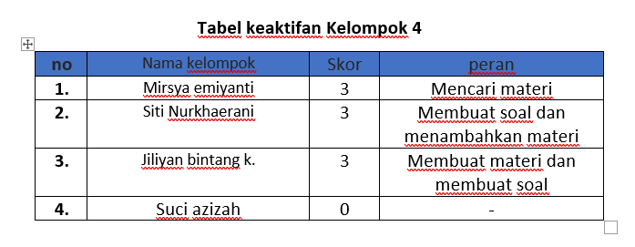
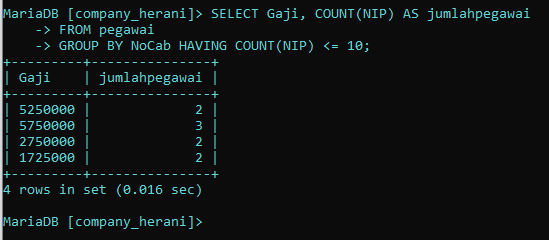
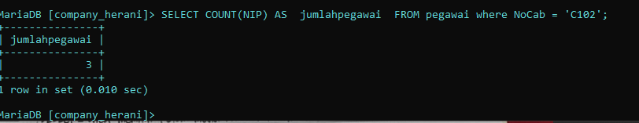
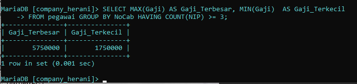
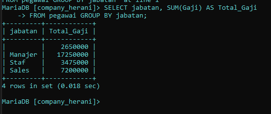
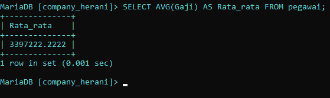
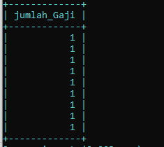

# NAMA ANGGOTA
1. MIRSYA EMIYANTI 
2. SITI NURKHAERANI
3. BINTANG
4. SUCI AZIZAH 

   
   
# Pengantar
SQL adalah bahasa yang digunakan untuk mengelola dan memanipulasi basis data relasional. Dalam materi yang akan di pelajari kali ini yaitu GROUP BY , HAVING , dan COUNT. Pada SQL mereka adalah klausa penting yang sering digunakan untuk melakukan agregasi dan penyaringan data dalam kelompok.
# GROUP BY
## PENGERTIAN 
GROUP BY digunakan untuk mengelompokkan baris yang memiliki nilai yang sama dalam satu atau lebih kolom. Klausa ini sering digunakan bersama fungsi agregat (seperti COUNT , SUM , AVG , dll.) untuk melakukan operasi pada setiap kelompok.

## CONTOH KODE 
### SINTAKS
```SQL 
SELECT kolom1, fungsi_agregat(kolom2) FROM nama_tabel GROUP BY kolom1;
```
### contoh penggunaan
misalnya kita memiliki table pegawai 

untuk menghitung jumlah pegawai yang ada, kita bisa menggunakan query berikut : 
```sql 
SELECT NoCab, COUNT(NIP) AS jumlah_pegawai FROM pegawai GROUP BY NoCab;
```
HASIL : 

ANALISIS : 
- `SELECT NoCab` : digunakan untuk menentukan kolom `NoCab`  yang ingin tampilkan dalam hasil query.
- `COUNT(NIP)` :  digunakan untuk menghitung jumlah kolom pada tabel `pegawai`  yang di mana `(NIP)` berfungsi menghitung  jumlah baris yang ada di dalamnya. 
- `AS jumlah_pegawai` : Hasil perhitungan diberi nama `jumlah_pegawai`, yang menjelaskan bahwa ini adalah jumlah total pegawai.
- `FROM pegawai ` : digunakana untuk menunjukkan dari tabel mana data tersebut diambil, data diambil dari tabel `pegawai`.
- `GROUP BY NoCab` : digunakan untuk mengelompokkan hasil berdasarkan kolom `NoCab`. yang dimana akan dihitung jumlah pegawai (`jumlah_pegawai`) untuk setiap cabang.
# HAVING 
## PENGERTIAN 
HAVING digunakan untuk memfilter hasil dari GROUP BY . Klausa ini mirip dengan WHERE , tetapi digunakan untuk memfilter kelompok, bukan baris individu. Perbedaan antara `WHERE` dan `HAVING`
- **WHERE**: Digunakan untuk memfilter baris sebelum pengelompokan terjadi (sebelum GROUP BY dijalankan).
- **HAVING**: Digunakan untuk memfilter hasil setelah pengelompokan dan agregasi selesai (setelah GROUP BY dijalankan).
## CONTOH KODE
### SINTAKS
```SQL 
SELECT kolom1, fungsi_agregat(kolom2) FROM nama_tabel GROUP BY kolom1 HAVING fungsi_agregat(kolom2) operator nilai;
```

### Contoh penggunaan
Untuk menampilkan kolom gaji dan kolom jumlah pengawai lebih kecil dari atau sama dengan 10, kita bisa menggunakan query berikut : 

```sql
SELECT Gaji, COUNT(NIP) AS jumlahpegawai
FROM pegawai
GROUP BY NoCab HAVING COUNT(NIP) <= 10;
```
HASIL : 


ANALISIS : 
- `SELECT` : digunakan untuk menentukan kolom apa  yang ingin  tampilkan dalam hasil query. Kolom `Gaji` dipilih untuk ditampilkan.
- `COUNT(NIP)` : `COUNT` digunakan untuk menghitung jumlah baris yang memiliki nilai. Kolom `NIP` adalah Nomor Induk Pegawai, yang merupakan identifikasi unik untuk setiap pegawai. 
- `AS jumlahpegawai` : Hasil perhitungan diberi nama `jumlahpegawai`, yang menjelaskan bahwa ini adalah jumlah total pegawai. 
- `FROM pegawai` : digunakan untuk menentukan tabel yang akan diambil, data diambil dari tabel `pegawai`.
- `GROUP BY NoCab` : digunakan untuk mengelompokkan hasil berdasarkan kolom `NoCab`. yang dimana akan dihitung jumlah pegawai (`jumlah_pegawai`) untuk setiap cabang.
- `HAVING COUNT(NIP) >= 10` :  digunakan untuk memfilter hasil dari grup yang sudah dibentuk oleh `GROUP BY`. Dalam hal ini  grup-grup tersebut akan disaring dan hanya menampilkan cabang-cabang di mana jumlah pegawai (`jumlah_pegawai`) sama dengan atau lebih dari 10. 
# COUNT
## PENGERTIAN
**COUNT** dalam SQL digunakan untuk menghitung jumlah baris yang sesuai dengan kondisi tertentu dalam sebuah query. Fungsi ini sangat berguna untuk menghitung banyaknya data yang memenuhi syarat tertentu tanpa perlu menampilkan data itu sendiri.

## Contoh Kode
### sintaks 

```sql 
SELECT COUNT(kolom) FROM nama_tabel WHERE kondisi;
```

### contoh penggunaan

```sql 
SELECT NoCab, COUNT(NIP) AS jumlahpegawai FROM pegawai WHERE NoCab = 'C102'
```

HASIL 


analisis : 
  - `SELECT` : digunakan untuk menentukan kolom apa yang ingin tampilkan dalam hasil query. 
  - `COUNT(NIP)` :  digunakan untuk menghitung jumlah kolom pada tabel `pegawai`  yang di mana `(NIP)` berfungsi menghitung  jumlah baris yang ada di dalamnya. 
  - `AS jumlahpegawai` : Hasil perhitungan diberi nama `jumlahpegawai`, yang menjelaskan bahwa ini adalah jumlah total pegawai.
  - `FROM pegawai` : digunakan untuk menunjukkan dari tabel mana data tersebut diambil, data diambil dari tabel `pegawai`.
  - `WHERE NoCab = 'C102'` :  digunakan untuk menyeleksi data pada baris dalam tabel `pegawai` yang memilki data `NoCab` sama dengan `C102` yang akan dihitung. 

# penggabungan COUNT, HAVING, dan GROUP BY

Hubungan antara HAVING, GROUP BY, dan COUNT dalam SQL, terutama ketika kita ingin melakukan pengelompokan data dan kemudian memfilter hasil pengelompokan berdasarkan jumlah (count) dari elemen-elemen dalam kelompok tersebut. 

1. **GROUP BY**:
   - GROUP BY digunakan untuk mengelompokkan baris data berdasarkan satu atau lebih kolom. Setelah pengelompokan, fungsi agregat seperti COUNT, SUM, AVG, dll., dapat diterapkan pada setiap kelompok.
2. **COUNT**:
   - COUNT adalah fungsi agregat yang digunakan untuk menghitung jumlah baris dalam setiap kelompok yang dihasilkan oleh GROUP BY. kita bisa menghitung jumlah total baris (COUNT( )) atau menghitung berapa kali nilai tertentu muncul dalam kolom (COUNT(kolom)).
3. **HAVING**:
   - HAVING digunakan untuk memfilter hasil yang telah dikelompokkan oleh GROUP BY, berdasarkan kondisi yang melibatkan fungsi agregat seperti COUNT.

Hubungan antara  GROUP BY, COUNT, dan HAVING:

1. Pengelompokan Data (GROUP BY):
   - Data dikelompokkan berdasarkan satu atau lebih kolom menggunakan GROUP BY.
2. Menghitung Jumlah Elemen dalam Kelompok (COUNT):
   - Setelah data dikelompokkan, COUNT digunakan untuk menghitung jumlah baris atau elemen dalam setiap kelompok yang dihasilkan oleh GROUP BY.
3. Memfilter Kelompok Berdasarkan Kondisi (HAVING):
   - HAVING kemudian digunakan untuk memfilter kelompok berdasarkan hasil fungsi agregat, seperti COUNT. ini memungkinkan kita hanya menampilkan kelompok yang memenuhi kondisi tertentu.

**contoh penggunaan**
CODE
```sql 
SELECT MAX(Gaji) AS Gaji_Terbesar, MIN(Gaji) AS Gaji_Terkecil, 
FROM pegawai GROUP BY NoCab HAVING COUNT(NIP) >= 3;
```  
HASIL : 


ANALISIS : 
  - `SELECT` : digunakan untuk menentukan kolom mana yang ingin ditampilkan dalam hasil.
  - `MAX(Gaji)` : `MAX()` digunakan untuk menemukan nilai maksimum (nilai terbesar) dari kolom. `Gaji` adalah kolom yang berisi nilai gaji dari setiap pegawai.
  - `AS Gaji_Terbesar` : Hasil perhitungan diberi nama `Gaji_Terbesar`, yang menjelaskan bahwa ini adalah maksimum atau nilai terbesar gaji pada kolom pegawai.
  - `MIN(Gaji)` : `MIN()` digunakan untuk menentukan nilai minimum atau nilai terkecil dari kolom. `Gaji` adalah kolom yang berisi nilai gaji dari setiap pegawai.
  - `AS Gaji_Terkecil` : Hasil perhitungan diberi nama `Gaji_Terkecil`, yang menjelaskan bahwa ini adalah minimum atau nilai terkecil gaji pada kolom pegawai.
  - `FROM pegawai` : digunakana untuk menunjukkan dari tabel mana data tersebut diambil, data diambil dari tabel `pegawai`.
  - `GROUP BY NoCab` : digunakan untuk mengelompokkan data berdasarkan kolom `NoCab`
  - `HAVING COUNT(NIP) >= 3` : digunakan untuk menyaring kelompok hasil setelah proses `GROUP BY`. `COUNT(NIP)` yang digunakan untuk menghitung jumlah baris dalam setiap kelompok yang memiliki nilai `NIP` kondisi ` >= 3` berarti hanya yang memiliki tiga atau lebih pegawai yang akan ditampilkan dalam hasil.

# Fungsi agregat 
1. SUM
   `sum` merupakan fungsi agregat yang digunakan untuk menghitung jumlah total dari nilai  dalam kolom yang sudah ditentukan. fungsi ini berguna untuk menjumlahkan nilai dari semua baris dalam kelompok data.

   contoh : 
  ```sql 
  SELECT NoCab, SUM(Gaji) AS Total_Gaji
  FROM pegawai 
  GROUP BY jabatan; 
  ```

  

2. AVG
   `AVG` merupakan fungsi agregat yang digunakan untuk menghitung rata-rata nilai dari kolom numerik. Fungsi ini memberikan nilai rata-rata berdasarkan beris yang dipilih atau dikelompokkan .

   **contoh** 
  ```sql
  SELECT AVG(Gaji) AS Rata_rata FROM pegawai;
  ```

  
   
3. MAX
   `MAX` merupakan fungsi agregat yang digunakan untuk mengembalikan nilai maksimum dari kolom numerik. fungsi ini berguna untuk menemukan nilai terbesar dalam data.

   **contoh** 
  ```sql
  SELECT MAX(Gaji) AS Gaji_terbesar
  FROM pegawai; 
  ```

   
4. MIN 
  `MIN` merupakan fungsi digunakan untuk mengembalikan nilai minimum dari kolom numerik. fungsi ini berguna untuk menemukan nilai terkecil dalam data.

  **CONTOH** 
 ```sql 
 SELECT MIN(Gaji) AS Gaji_terkecil FROM pegawai;  
 ```

  
