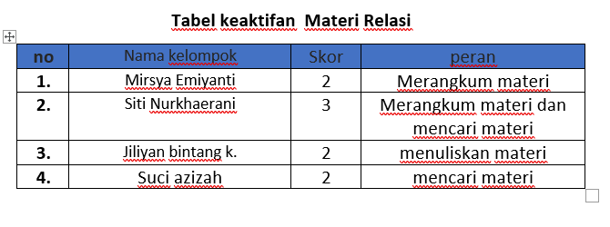

# Pengantar 
Relasi pada database merujuk pada hubungan antara tabel-tabel yang ada dalam sistem basis data atau database. Hubungan ini dibuat menggunakan `Primary Key` dan `Foreign Key` untuk memastikan data terorganisasi/ terhubung dengan baik dan mendukung integritas data.

# pengertian Relasi
Relasi adalah hubungan logis antara tabel-tabel dalam database, yang digunakan untuk menghubungkan data di satu tabel dengan data di tabel lain. Relasi dibuat dengan memanfaatkan `Primary Key` di satu tabel dan `Foreign Key` di tabel lain.

# Jenis-jenis relasi yang terdapat
1. one to one (1:1)
  setiap baris di tabel A berhubungan dengan satu baris di tabel B. Menghubungkan dua entitas di mana setiap entitas di sisi pertama hanya dapat berhubungan dengan satu entitas di sisi kedua, dan sebaliknya.
  contoh: jika kita memiliki tabel A bernama prestasi dan tabel B bernama detail_prestasi. ini berarti tabel prestasi memiliki data hanya satu pada tabel detail_prestasi karena setiap prestasi memiliki satu detail prestasi, bukan bayak.
2. one to many (1:N)
  satu baris di tabel A berhubungan dengan banyak baris di tabel B. Menunjukkan bahwa satu entitas di sisi "1" dapat memiliki banyak relasi dengan entitas di sisi "N", namun setiap entitas di sisi "N" hanya dapat berelasi dengan satu entitas di sisi "1".
  contoh: jika kita memiliki tabel A bernama siswa dan tabel B bernama prestasi. ini berarti tabel siswa bisa memiliki banyak baris di tabel prestasi karena satu siswa bisa mamiliki banyak prestasi 
3. many to many(N:N)
  satu baris di tabel A dapat berhubungan dengan banyak baris di tabel B, begitupun sebaliknya. Menunjukkan bahwa setiap entitas di kedua sisi hubungan dapat berelasi dengan banyak entitas lainnya. Kardinalitas N-to-N sering kali memerlukan tabel penghubung (junction table) untuk mengimplementasikan relasi
  contoh: jika kita mempunyai tabel A dengan nama peminjam dan tabel B dengan nama buku harus memakai tabel penghubung berupa tabel peminjaman_buku 

# Elemen Utama dalam Relasi*
1. *Primary Key*:
   - Digunakan untuk mengidentifikasi setiap baris dalam tabel secara unik.
   - Contoh: Kolom id dalam tabel customers.

2. *Foreign Key*:
   - Kolom yang berisi nilai dari primary key tabel lain untuk membuat hubungan antar tabel.
   - Contoh: Kolom customer_id dalam tabel orders.

3. *Referential Integrity*:
   - Menjamin bahwa nilai pada kolom foreign key sesuai dengan nilai pada kolom primary key di tabel yang dirujuk.

