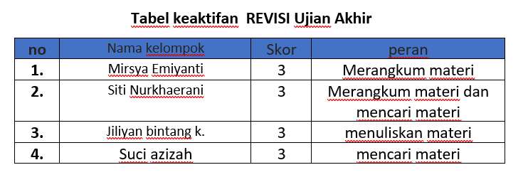

# REVISI UJIAN



## 1. Menambahkan id detail prestasi pada tabel prestasi


## 2. Menghapus Kolom Nama pada detail prestasi


## 3. Mengubah Kardinalitas pada siswa Ke prestasi 


### 1. **Relasi "Siswa Memiliki Prestasi" (N:N)**
- **Kardinalitas:**
  1. **Siswa (N):** Seorang siswa dapat memiliki lebih dari satu prestasi.
  2.  **Prestasi (N):** Satu prestasi dapat dimiliki oleh lebih dari satu siswa (misalnya, lomba yang melibatkan beberapa siswa).
- **Makna Relasi:**  
   Hubungan ini menunjukkan bahwa siswa dan prestasi saling berhubungan secara fleksibel, tanpa pembatasan jumlah.

### 2. **Relasi "Prestasi Mencatat Detail_Prestasi" (1:1)**
- **Kardinalitas:**
 1. **Prestasi (1):** Setiap prestasi hanya memiliki satu detail terkait yang mencatat informasi lebih spesifik.
 2.  **Detail_Prestasi (1):** Satu detail hanya dapat terkait dengan satu prestasi.
- **Makna Relasi:**  
  Hubungan ini menunjukkan bahwa untuk setiap prestasi, ada satu entri detail yang mencatat informasi seperti nama prestasi, keterangan, dan tingkatnya.

### 3. **Relasi "Guru Membimbing Prestasi" (N:N)**
- **Kardinalitas:**
 1. **Guru_Pembimbing (N):** Seorang guru dapat membimbing lebih dari satu prestasi.
 2. **Prestasi (N):** Satu prestasi dapat dibimbing oleh lebih dari satu guru (misalnya, dalam proyek kelompok).
- **Makna Relasi:**  
  Hubungan ini menunjukkan bahwa guru dan prestasi juga saling terkait secara fleksibel.

## 4. Menambahkan id membimbing pada tabel Membimbing untuk Primary Key


## 5. Menyesuaikan Judul dan tujuan pada contoh query pertama 

### Menampilkan data siswa yang memiliki banyak prestasi

```sql
SELECT
    -> s.nama AS nama_siswa, COUNT(dp.id_prestasi) AS total_prestasi
    -> FROM siswaa s
    -> JOIN detail_prestasi dp ON s.nis = dp.id_siswa
    -> GROUP BY s.nis, s.nama
    -> ORDER BY total_prestasi DESC;
```

Hasil: 


#### **Konteks query**

**1. Tujuan Query**
 - Query ini bertujuan untuk menampilkan daftar siswa beserta jumlah prestasi yang telah diraih oleh masing-masing siswa.

**2. Cara Relasi**
   1.**Relasi antara `siswa` dan `detail_prestasi`:**
   - Kolom `nis` di tabel `siswa` digunakan sebagai penghubung dengan kolom `id_siswa` di tabel `detail_prestasi`.
   - Relasi ini memungkinkan kita untuk menghubungkan data siswa dengan data prestasi yang ada di tabel `detail_prestasi`.

**3. Cara Agregasi**
 1. **Fungsi Agregasi `COUNT`:**
  - Fungsi `COUNT(dp.id_prestasi)` digunakan untuk menghitung jumlah prestasi (`id_prestasi`) yang tercatat di tabel `detail_prestasi` untuk setiap siswa.
 2. **Klausa `GROUP BY`:**
  - Data dikelompokkan berdasarkan kolom `s.nis` dan `s.nama`, sehingga hasilnya adalah satu baris untuk setiap siswa.
 3. **Klausa `ORDER BY`:**
  - Data diurutkan berdasarkan kolom `total_prestasi` dalam urutan menurun (`DESC`), sehingga siswa dengan jumlah prestasi terbanyak akan muncul di bagian atas.

#### **Analisis**

#### 1. *SELECT s.nama AS nama_siswa, COUNT(dp.id_prestasi) AS total_prestasi*  
1. *SELECT:*  
  - Digunakan untuk memilih kolom yang akan ditampilkan dalam hasil query.  

2. *s.nama AS nama_siswa:*  
  - Kolom nama dari tabel siswaa dipilih untuk ditampilkan.  
  - Diberi alias nama_siswa agar lebih mudah dipahami dalam hasil akhir.  

3. *COUNT(dp.id_prestasi) AS total_prestasi:*  
 - Fungsi agregasi COUNT() digunakan untuk menghitung jumlah data pada kolom id_prestasi di tabel detail_prestasi.  
 - Hasil dari fungsi COUNT() diberi nama alias total_prestasi agar lebih deskriptif.  


#### 2. *FROM siswaa s*  
   - Digunakan untuk menentukan tabel utama, yaitu siswaa.  
   - Tabel ini diberi alias s untuk mempermudah penulisan query.  

#### 3. *JOIN detail_prestasi dp ON s.nis = dp.id_siswa*  
  1. *JOIN:*  
   - Menggabungkan tabel siswaa (alias s) dengan tabel detail_prestasi (alias dp).  

  2.  *ON s.nis = dp.id_siswa:*  
   - Relasi dibuat dengan mencocokkan kolom nis dari tabel siswaa dengan kolom id_siswa dari tabel detail_prestasi.  
   - Hal ini memastikan bahwa setiap siswa hanya terhubung dengan data prestasi yang relevan.  

#### 4. *GROUP BY s.nis, s.nama*  
   - *GROUP BY:*  
   - Digunakan untuk mengelompokkan data berdasarkan kolom nis dan nama.  
   - Setiap grup mewakili satu siswa.  
   - Fungsi agregasi (COUNT) diterapkan pada masing-masing grup untuk menghitung jumlah prestasi.  

#### 5. *ORDER BY total_prestasi DESC*  
1.  *ORDER BY:*  
  - Digunakan untuk mengurutkan hasil query.  

2. *total_prestasi DESC:*  
  - Hasil diurutkan berdasarkan kolom total_prestasi dalam urutan menurun (dari jumlah prestasi terbanyak ke terkecil).  