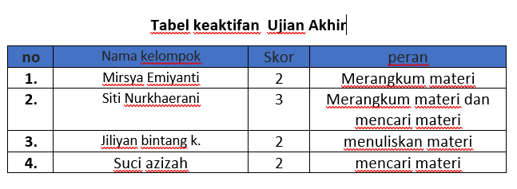
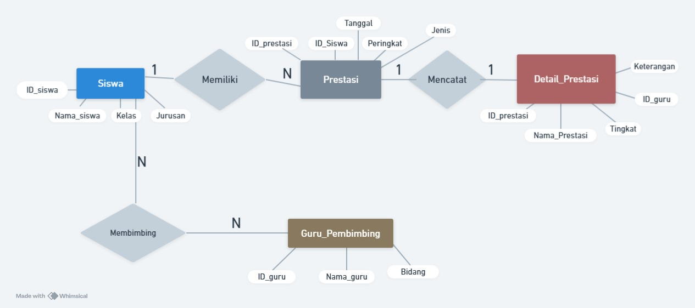
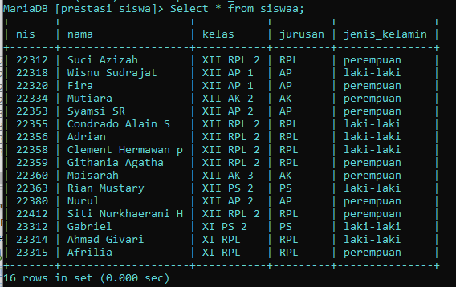
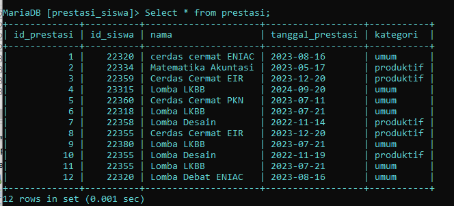
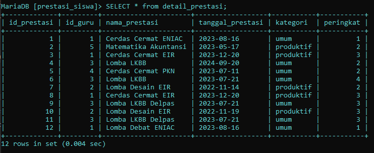
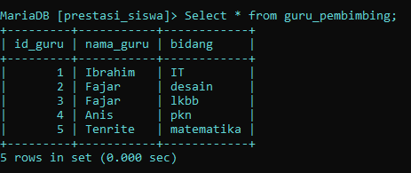
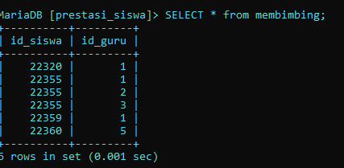
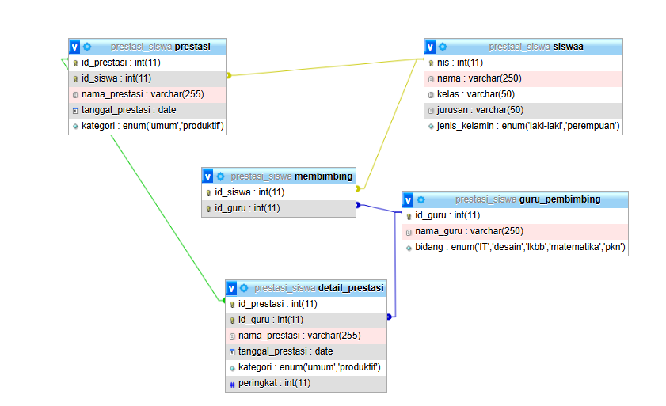
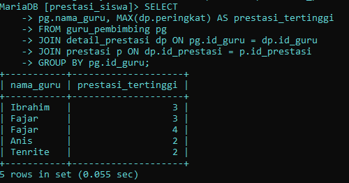
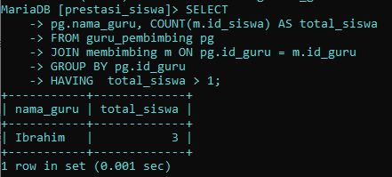

# Ujian Akhir

tabel Keaktifan


perancangan ERD: 



Data tabel keseluruhan
tabel siswa: 



tabel prestasi: 



tabel detail prestasi: 



tabel guru pembimbing: 



tabel membimbing: 



Bukti Relasi: 



## **Penjelasan :**
### **1. Tabel `siswaa`**
1. **Kolom Utama**:
 - `nis` (Nomor Induk Siswa) sebagai **Primary Key**.
2. **Deskripsi**:
  - Tabel ini menyimpan data siswa, seperti nama, kelas, jurusan, dan jenis kelamin.
3. **Relasi**:
  - Tabel ini berelasi dengan tabel `prestasi` melalui kolom **`nis = id_siswa`**.
  - Tabel ini juga berelasi dengan tabel `membimbing` melalui kolom **`nis = id_siswa`**.

### **2. Tabel `prestasi`**

1. **Kolom Utama**:
 - `id_prestasi` sebagai **Primary Key**.
2. **Deskripsi**:
 - Tabel ini menyimpan data tentang prestasi yang diraih siswa, seperti nama prestasi, tanggal prestasi, dan kategori prestasi (umum atau produktif).
3. **Relasi**:
  - **Ke tabel `siswaa`**: Kolom **`id_siswa`** di tabel `prestasi` berelasi dengan kolom **`nis`** di tabel `siswaa`.
  - Relasi ini menunjukkan siapa siswa yang mendapatkan prestasi tertentu.
  - **Ke tabel `detail_prestasi`**: Kolom **`id_prestasi`** di tabel `prestasi` berelasi dengan kolom yang sama di tabel `detail_prestasi`.

---

### **3. Tabel `guru_pembimbing`**
1. **Kolom Utama**:
  - `id_guru` sebagai **Primary Key**.
2. **Deskripsi**:
  - Tabel ini menyimpan data guru pembimbing, termasuk nama guru dan bidang keahlian (seperti IT, desain, dll).
3. **Relasi**:
  - **Ke tabel `membimbing`**: Kolom **`id_guru`** di tabel `guru_pembimbing` berelasi dengan kolom yang sama di tabel `membimbing`.
### **4. Tabel `membimbing`**
1. **Kolom Utama**:
  - Kombinasi **`id_siswa`** dan **`id_guru`** (komposit key).
2. **Deskripsi**:
  - Tabel ini menjelaskan hubungan antara siswa dan guru, yaitu guru mana yang membimbing siswa tertentu.
3. **Relasi**:
  - **Ke tabel `siswaa`**: Kolom **`id_siswa`** di tabel `membimbing` berelasi dengan kolom **`nis`** di tabel `siswaa`.
 - **Ke tabel `guru_pembimbing`**: Kolom **`id_guru`** di tabel `membimbing` berelasi dengan kolom **`id_guru`** di tabel `guru_pembimbing`.
### **5. Tabel `detail_prestasi`**

1. **Kolom Utama**:
  - `id_prestasi` sebagai **Primary Key**.
2.  **Deskripsi**:
  - Tabel ini menyimpan detail lebih lanjut tentang prestasi siswa, seperti nama prestasi, tanggal, kategori, dan peringkat.
3. **Relasi**:
  - **Ke tabel `prestasi`**: Kolom **`id_prestasi`** di tabel `detail_prestasi` berelasi dengan kolom yang sama di tabel `prestasi`.
  - **Ke tabel `guru_pembimbing`**: Kolom **`id_guru`** di tabel `detail_prestasi` berelasi dengan kolom yang sama di tabel `guru_pembimbing`.
  - Relasi ini menunjukkan guru pembimbing yang terlibat dalam membantu siswa mencapai prestasi tertentu.

### **Relasi Utama**

1. **Siswa dan Prestasi**:
  - Relasi antara tabel `siswaa` dan `prestasi` menunjukkan siswa mana yang mendapatkan prestasi tertentu.
2. **Guru dan Siswa**:
  - Relasi antara tabel `guru_pembimbing` dan `siswaa` melalui tabel `membimbing` menunjukkan hubungan guru-siswa (guru membimbing siswa tertentu).
3. **Prestasi dan Guru**:
  - Relasi antara tabel `prestasi`, `detail_prestasi`, dan `guru_pembimbing` menunjukkan prestasi yang diraih siswa dengan bantuan guru pembimbing tertentu.


## Contoh penggunaan menggunakan code
### 1. menampilkan data guru dan prestasi tertinggi yang didapatkan siswa
code: 
```sql
    SELECT
    -> pg.nama_guru, MAX(dp.peringkat) AS prestasi_tertinggi
    -> FROM guru_pembimbing pg
    -> JOIN detail_prestasi dp ON pg.id_guru = dp.id_guru
    -> JOIN prestasi p ON dp.id_prestasi = p.id_prestasi
    -> GROUP BY pg.id_guru;
```
Hasil : 



analisis :

**1. SELECT pg.nama_guru, MAX(p.peringkat) AS prestasi_tertinggi**
- SELECT : 
  Code ini digunakan untuk menampilka data yang sudah di masukkan
- *pg.nama_guru*:
   code ini memilih nama guru dari tabel guru_pembimbing untuk ditampilkan dalam hasil query.
- *MAX(p.peringkat)*:
   Fungsi agregasi MAX() digunakan untuk mencari nilai peringkat tertinggi dari tabel prestasi.
- *AS prestasi_tertinggi*:
  Memberi nama alias "prestasi_tertinggi" untuk kolom hasil fungsi MAX() sehingga lebih mudah dipahami.

**2. FROM guru_pembimbing pg**
- Menentukan tabel utama, yaitu guru_pembimbing, dengan alias *g*.
- Alias ini digunakan untuk mempersingkat penulisan referensi tabel dalam query.

**3. JOIN detail_prestasi d ON pg.id_guru = dp.id_guru*
- **JOIN** menghubungkan tabel guru_pembimbing `(pg)` dengan tabel detail_prestasi `(dp).`
- Kondisi **ON** `pg.id_guru` = `dp.id_guru` berarti data guru akan dicocokkan berdasarkan kolom `id_guru` pada kedua tabel.
- Relasi ini memastikan setiap data prestasi terkait dengan guru yang membimbingnya.

**4. JOIN prestasi p ON dp.id_prestasi = p.id_prestasi**
- **JOIN** menghubungkan tabel detail_prestasi `(dp)` dengan tabel prestasi `(p)`.
- Kondisi **ON** `d.id_prestasi` = `p.id_prestasi` memastikan data prestasi terkait dengan detail prestasi tertentu.

 **5. GROUP BY pg.id_guru**
- **GROUP BY** digunakan untuk mengelompokkan data berdasarkan kolom `id_guru` (unik untuk setiap guru).
- Setiap kelompok data berisi semua baris yang berkaitan dengan satu guru.
- Setelah data dikelompokkan, fungsi agregasi seperti MAX() dapat bekerja pada setiap kelompok secara efektif.

### 2. Menampilkan data guru yang paling banykan membimbing siswa
code: 
```sql 
SELECT
    -> pg.nama_guru, COUNT(m.id_siswa) AS total_siswa
    -> FROM guru_pembimbing pg
    -> JOIN membimbing m ON pg.id_guru = m.id_guru
    -> GROUP BY pg.id_guru
    -> HAVING  total_siswa > 1;
```

hasil: 


analisis: 

**1. SELECT pg.nama_guru, COUNT(m.id_siswa) AS total_siswa**
- SELECT : 
  Code ini digunakan untuk menampilka data yang sudah di masukkan
- pg.nama_guru:
   Bagian ini memilih nama guru dari tabel guru_pembimbing untuk ditampilkan dalam hasil query.
- COUNT(m.id_siswa):
   Fungsi agregasi COUNT() digunakan untuk menghitung jumlah siswa `(id_siswa)` yang dibimbing oleh masing-masing guru.
- AS total_siswa:
   Memberikan nama alias "total_siswa" pada kolom hasil hitungan sehingga lebih mudah dibaca.

**2. FROM guru_pembimbing pg**
- Menentukan tabel utama yang akan digunakan, yaitu guru_pembimbing, dengan alias **pg**.
- Alias ini digunakan agar penulisan lebih singkat dan mudah saat mereferensikan tabel dalam query.

**3. JOIN membimbing m ON pg.id_guru = m.id_guru**
- **JOIN** menghubungkan tabel guru_pembimbing `(pg)` dengan tabel membimbing `(m)`.
- Kondisi **ON** `g.id_guru` = `m.id_guru`:
  - Menghubungkan baris di tabel guru_pembimbing dengan baris di tabel membimbing berdasarkan kolom `id_guru.`
  - Artinya, query akan mencocokkan data setiap guru dengan data siswa yang dibimbing oleh guru tersebut.

**4. GROUP BY pg.id_guru**
- **GROUP BY** digunakan untuk mengelompokkan data berdasarkan kolom `id_guru`.
- Setiap kelompok data mewakili satu guru, dan fungsi agregasi seperti **COUNT()** akan menghitung jumlah siswa dalam setiap kelompok.

**5. HAVING total_siswa > 1**
- **HAVING** digunakan untuk memfilter hasil setelah data dikelompokkan.
- Kondisi `total_siswa > 1` berarti hanya guru yang membimbing lebih dari 1 siswa yang akan ditampilkan.
- Misalnya, jika ada guru yang hanya membimbing 1 siswa, data mereka akan dikeluarkan dari hasil.


