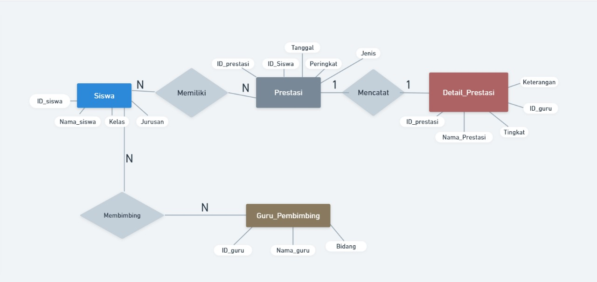

# Revisi Query

tabel Keaktifan


perancangan ERD: 


Revisi ERD 

### 1. **Relasi "Siswa Memiliki Prestasi" (N:N)**
- **Kardinalitas:**
  1. **Siswa (N):** Seorang siswa dapat memiliki lebih dari satu prestasi.
  2.  **Prestasi (N):** Satu prestasi dapat dimiliki oleh lebih dari satu siswa (misalnya, lomba yang melibatkan beberapa siswa).
- **Makna Relasi:**  
   Hubungan ini menunjukkan bahwa siswa dan prestasi saling berhubungan secara fleksibel, tanpa pembatasan jumlah.

### 2. **Relasi "Prestasi Mencatat Detail_Prestasi" (1:1)**
- **Kardinalitas:**
 1. **Prestasi (1):** Setiap prestasi hanya memiliki satu detail terkait yang mencatat informasi lebih spesifik.
 2.  **Detail_Prestasi (1):** Satu detail hanya dapat terkait dengan satu prestasi.
- **Makna Relasi:**  
  Hubungan ini menunjukkan bahwa untuk setiap prestasi, ada satu entri detail yang mencatat informasi seperti nama prestasi, keterangan, dan tingkatnya.

### 3. **Relasi "Guru Membimbing Prestasi" (N:N)**
- **Kardinalitas:**
 1. **Guru_Pembimbing (N):** Seorang guru dapat membimbing lebih dari satu prestasi.
 2. **Prestasi (N):** Satu prestasi dapat dibimbing oleh lebih dari satu guru (misalnya, dalam proyek kelompok).
- **Makna Relasi:**  
  Hubungan ini menunjukkan bahwa guru dan prestasi juga saling terkait secara fleksibel.

Data tabel keseluruhan
tabel siswa: 


tabel prestasi: 


Revisi tabel Presatasi


tabel detail prestasi: 


Revisi tabel detail prestasi


tabel guru pembimbing: 


berikut Penjelasannya mengapa muncul dua kali dengan bidang yang berbeda
1. **Fajar** di bidang **desain**
2. **Fajar** di bidang **lkbb**

### Penjelasan:
1. **Nama yang Sama, Tugas Berbeda**  
  Nama yang sama (Fajar) dapat merujuk pada **orang yang sama** tetapi memiliki **dua tugas atau bidang tanggung jawab** yang berbeda. Dalam hal ini, satu tugas sebagai pembimbing di bidang "desain", dan satu lagi di bidang "lkbb".
2. **Data yang Relevan dengan Sistem**
- Hal ini terjadi karena seorang guru dapat memiliki lebih dari satu bidang keahlian atau tanggung jawab dalam membimbing siswa, tergantung pada kompetensinya.

Revisi Tabel Guru Pembimbing: 


tabel membimbing: 


Bukti Relasi: 


## **Penjelasan :**
### **1. Tabel `siswaa`**
1. **Kolom Utama**:
 - `nis` (Nomor Induk Siswa) sebagai **Primary Key**.
2. **Deskripsi**:
  - Tabel ini menyimpan data siswa, seperti nama, kelas, jurusan, dan jenis kelamin.
3. **Relasi**:
  - Tabel ini berelasi dengan tabel `prestasi` melalui kolom **`nis = id_siswa`**.
  - Tabel ini juga berelasi dengan tabel `membimbing` melalui kolom **`nis = id_siswa`**.

### **2. Tabel `prestasi`**

1. **Kolom Utama**:
 - `id_prestasi` sebagai **Primary Key**.
2. **Deskripsi**:
 - Tabel ini menyimpan data tentang prestasi yang diraih siswa, seperti nama prestasi, tanggal prestasi, dan kategori prestasi (umum atau produktif).
3. **Relasi**:
  - **Ke tabel `siswaa`**: Kolom **`id_siswa`** di tabel `prestasi` berelasi dengan kolom **`nis`** di tabel `siswaa`.
  - Relasi ini menunjukkan siapa siswa yang mendapatkan prestasi tertentu.
  - **Ke tabel `detail_prestasi`**: Kolom **`id_prestasi`** di tabel `prestasi` berelasi dengan kolom yang sama di tabel `detail_prestasi`.

### **3. Tabel `guru_pembimbing`**
1. **Kolom Utama**:
  - `id_guru` sebagai **Primary Key**.
2. **Deskripsi**:
  - Tabel ini menyimpan data guru pembimbing, termasuk nama guru dan bidang keahlian (seperti IT, desain, dll).
3. **Relasi**:
  - **Ke tabel `membimbing`**: Kolom **`id_guru`** di tabel `guru_pembimbing` berelasi dengan kolom yang sama di tabel `membimbing`.
### **4. Tabel `membimbing`**
1. **Kolom Utama**:
  - Kombinasi **`id_siswa`** dan **`id_guru`** (komposit key).
2. **Deskripsi**:
  - Tabel ini menjelaskan hubungan antara siswa dan guru, yaitu guru mana yang membimbing siswa tertentu.
3. **Relasi**:
  - **Ke tabel `siswaa`**: Kolom **`id_siswa`** di tabel `membimbing` berelasi dengan kolom **`nis`** di tabel `siswaa`.
 - **Ke tabel `guru_pembimbing`**: Kolom **`id_guru`** di tabel `membimbing` berelasi dengan kolom **`id_guru`** di tabel `guru_pembimbing`.
### **5. Tabel `detail_prestasi`**

1. **Kolom Utama**:
  - `id_prestasi` sebagai **Primary Key**.
2.  **Deskripsi**:
  - Tabel ini menyimpan detail lebih lanjut tentang prestasi siswa, seperti nama prestasi, tanggal, kategori, dan peringkat.
3. **Relasi**:
  - **Ke tabel `prestasi`**: Kolom **`id_prestasi`** di tabel `detail_prestasi` berelasi dengan kolom yang sama di tabel `prestasi`.
  - **Ke tabel `guru_pembimbing`**: Kolom **`id_guru`** di tabel `detail_prestasi` berelasi dengan kolom yang sama di tabel `guru_pembimbing`.
  - Relasi ini menunjukkan guru pembimbing yang terlibat dalam membantu siswa mencapai prestasi tertentu.

### **Relasi Utama**

1. **Siswa dan Prestasi**:
  - Relasi antara tabel `siswaa` dan `prestasi` menunjukkan siswa mana yang mendapatkan prestasi tertentu.
2. **Guru dan Siswa**:
  - Relasi antara tabel `guru_pembimbing` dan `siswaa` melalui tabel `membimbing` menunjukkan hubungan guru-siswa (guru membimbing siswa tertentu).
3. **Prestasi dan Guru**:
  - Relasi antara tabel `prestasi`, `detail_prestasi`, dan `guru_pembimbing` menunjukkan prestasi yang diraih siswa dengan bantuan guru pembimbing tertentu.


## Contoh penggunaan menggunakan code
### 1. menampilkan data guru dan prestasi tertinggi yang didapatkan siswa
code: 
```sql
    SELECT
    -> pg.nama_guru, MAX(dp.peringkat) AS prestasi_tertinggi
    -> FROM guru_pembimbing pg
    -> JOIN detail_prestasi dp ON pg.id_guru = dp.id_guru
    -> JOIN prestasi p ON dp.id_prestasi = p.id_prestasi
    -> GROUP BY pg.id_guru;
```
Hasil : 


#### Konteks Query
**Tujuan Query**
Query tersebut bertujuan untuk:
1. Mengambil nama setiap **guru pembimbing** dari tabel guru_pembimbing.
2. Menentukan *peringkat prestasi tertinggi* yang diraih oleh masing-masing guru pembimbing berdasarkan data yang ada di tabel prestasi.

**Cara Relasi**
Query menghubungkan tiga tabel menggunakan klausa JOIN:
1. **Tabel guru_pembimbing (alias: pg)**:
   - Berisi informasi tentang guru pembimbing.
   - Kolom id_guru digunakan untuk menyambungkan tabel ini dengan tabel detail_prestasi.
   
2. **Tabel detail_prestasi (alias: dp)**:
   - Merupakan tabel penghubung yang menghubungkan data guru dengan data prestasi.
   - Relasi:
  - Kolom id_guru di tabel ini merujuk ke kolom id_guru di tabel guru_pembimbing.
  - Kolom id_prestasi di tabel ini merujuk ke kolom id_prestasi di tabel prestasi.

3. **Tabel prestasi (alias: p)**:
   - Berisi informasi detail tentang prestasi, termasuk kolom peringkat yang digunakan untuk menentukan prestasi tertinggi.

**Cara Agregasi**
1. **Fungsi Agregasi MAX**:
  Fungsi MAX(p.peringkat) digunakan untuk mencari *peringkat tertinggi* dari data prestasi (kolom peringkat) untuk setiap guru pembimbing. 
2. **Klausa GROUP BY**:
  Data dikelompokkan berdasarkan g.id_guru, sehingga hasilnya adalah satu baris untuk setiap guru, dengan nama guru dan prestasi tertinggi mereka.

Analisis :

**1. SELECT pg.nama_guru, MAX(p.peringkat) AS prestasi_tertinggi**
- SELECT : 
  Code ini digunakan untuk menampilka data yang sudah di masukkan
- *pg.nama_guru*:
   code ini memilih nama guru dari tabel guru_pembimbing untuk ditampilkan dalam hasil query.
- *MAX(p.peringkat)*:
   Fungsi agregasi MAX() digunakan untuk mencari nilai peringkat tertinggi dari tabel prestasi.
- *AS prestasi_tertinggi*:
  Memberi nama alias "prestasi_tertinggi" untuk kolom hasil fungsi MAX() sehingga lebih mudah dipahami.

**2. FROM guru_pembimbing pg**
- Menentukan tabel utama, yaitu guru_pembimbing, dengan alias *g*.
- Alias ini digunakan untuk mempersingkat penulisan referensi tabel dalam query.

**3. JOIN detail_prestasi d ON pg.id_guru = dp.id_guru*
- **JOIN** menghubungkan tabel guru_pembimbing `(pg)` dengan tabel detail_prestasi `(dp).`
- Kondisi **ON** `pg.id_guru` = `dp.id_guru` berarti data guru akan dicocokkan berdasarkan kolom `id_guru` pada kedua tabel.
- Relasi ini memastikan setiap data prestasi terkait dengan guru yang membimbingnya.

**4. JOIN prestasi p ON dp.id_prestasi = p.id_prestasi**
- **JOIN** menghubungkan tabel detail_prestasi `(dp)` dengan tabel prestasi `(p)`.
- Kondisi **ON** `d.id_prestasi` = `p.id_prestasi` memastikan data prestasi terkait dengan detail prestasi tertentu.

 **5. GROUP BY pg.id_guru**
- **GROUP BY** digunakan untuk mengelompokkan data berdasarkan kolom `id_guru` (unik untuk setiap guru).
- Setiap kelompok data berisi semua baris yang berkaitan dengan satu guru.
- Setelah data dikelompokkan, fungsi agregasi seperti MAX() dapat bekerja pada setiap kelompok secara efektif.

#### Revisi QUERY 
Code: 
```sql
SELECT
    ->  s.nama AS nama_siswa,
    -> p.nama_prestasi AS nama_prestasi,
    -> gp.nama_guru AS guru_pembimbingi
    -> , dp.peringkat AS juara
    -> FROM siswaa s
    -> JOIN detail_prestasi dp ON s.nis = dp.id_siswa
    -> JOIN prestasi p ON dp.id_prestasi = p.id_prestasi
    -> JOIN guru_pembimbing gp ON dp.id_guru = gp.id_guru
    -> GROUP BY  s.nama, p.nama_prestasi, gp.nama_guru, dp.peringkat
    -> HAVING dp.peringkat <2
    -> ORDER BY dp.peringkat ASC;
```

Hasil: 


**Konteks QUERY**
### **Tujuan Query**

1. **Menampilkan Data Juara**:
 - Query ini bertujuan untuk mendapatkan data siswa yang menjadi juara dengan peringkat terbaik (peringkat < 2), yang berarti hanya siswa yang meraih peringkat 1.
2. **Menampilkan Informasi Lengkap**:
 - Data yang ditampilkan mencakup nama siswa, nama prestasi yang diraih, nama guru pembimbing yang membimbing prestasi tersebut, serta peringkat yang diraih.
3. **Mengelompokkan Data**:
 - Mengelompokkan hasil query berdasarkan siswa, prestasi, guru pembimbing, dan peringkat untuk memastikan data yang ditampilkan unik dan tidak berulang.
 4. . **Mengurutkan Hasil**:
 - Data diurutkan berdasarkan peringkat secara **ascending** (peringkat terkecil ditampilkan terlebih dahulu).

---

### **Cara Relasi**

1. **Relasi antara `siswaa` dan `detail_prestasi`**:
- **`s.nis = dp.id_siswa`**:
  - Relasi ini menunjukkan bahwa satu siswa dari tabel `siswaa` dapat memiliki banyak data prestasi di tabel `detail_prestasi` (relasi **1:N**).
2. **Relasi antara `detail_prestasi` dan `prestasi`**:  
- **`dp.id_prestasi = p.id_prestasi`**:
 - Relasi ini menghubungkan tabel `detail_prestasi` dengan tabel `prestasi`, sehingga data prestasi yang dirinci di `detail_prestasi` dapat diidentifikasi dengan nama prestasinya (relasi **N:1**).
3. **Relasi antara `detail_prestasi` dan `guru_pembimbing`**:
- **`dp.id_guru = gp.id_guru`**:
- Relasi ini menunjukkan bahwa setiap prestasi yang tercatat di `detail_prestasi` dibimbing oleh seorang guru dari tabel `guru_pembimbing` (relasi **N:1**).

---

### **Cara Agregasi**
1. **Pengelompokan Data (`GROUP BY`)**:
 - Query menggunakan **`GROUP BY s.nama, p.nama_prestasi, gp.nama_guru, dp.peringkat`** untuk memastikan setiap kombinasi siswa, prestasi, guru pembimbing, dan peringkat muncul hanya sekali dalam hasil.
 - Hal ini diperlukan untuk mengelola data yang berpotensi berulang karena relasi antar tabel.
2. **Filter Data dengan Agregasi (`HAVING`)**:
- **`HAVING dp.peringkat < 2`**:
- Digunakan untuk memfilter hanya siswa yang meraih peringkat pertama (peringkat < 2) setelah data dikelompokkan.
- **`HAVING`** digunakan setelah pengelompokan data, sedangkan **`WHERE`** digunakan sebelum pengelompokan.
3. **Urutan Hasil dengan Agregasi (`ORDER BY`)**:
- **`ORDER BY dp.peringkat ASC`**:
-  Mengurutkan hasil query berdasarkan peringkat secara ascending. Hal ini membantu menyajikan data dimulai dari peringkat yang tertinggi (peringkat 1).

**Analisis**
#### **1. SELECT**
1.  **`s.nama AS nama_siswa`**:
 - Memilih nama siswa dari tabel `siswaa` dan memberi alias `nama_siswa` agar lebih mudah dipahami.
2. **`p.nama_prestasi AS nama_prestasi`**:
 - Memilih nama prestasi dari tabel `prestasi` dan memberi alias `nama_prestasi`.
3. **`gp.nama_guru AS guru_pembimbingi`**:
 - Memilih nama guru dari tabel `guru_pembimbing` dan memberi alias `guru_pembimbingi` untuk ditampilkan.
4. **`dp.peringkat AS juara`**:
 - Memilih peringkat siswa dari tabel `detail_prestasi` dan memberi alias `juara`.

#### **2. FROM**
- **`siswaa s`**:
 - Menentukan tabel utama yang digunakan, yaitu tabel `siswaa` dengan alias `s`.
#### **3. JOIN**
1.  **`JOIN detail_prestasi dp ON s.nis = dp.id_siswa`**:
   - Menggabungkan tabel `detail_prestasi` dengan tabel `siswaa` berdasarkan relasi antara `nis` (di tabel `siswaa`) dan `id_siswa` (di tabel `detail_prestasi`).
2.  **`JOIN prestasi p ON dp.id_prestasi = p.id_prestasi`**:
   - Menggabungkan tabel `prestasi` dengan `detail_prestasi` berdasarkan relasi antara `id_prestasi` pada kedua tabel.
3. **`JOIN guru_pembimbing gp ON dp.id_guru = gp.id_guru`**:
  - Menggabungkan tabel `guru_pembimbing` dengan `detail_prestasi` berdasarkan relasi `id_guru`.

#### **4. GROUP BY**

- **`GROUP BY s.nama, p.nama_prestasi, gp.nama_guru, dp.peringkat`**:
  - Mengelompokkan data berdasarkan nama siswa, nama prestasi, nama guru, dan peringkat.
  - Hal ini memastikan setiap kombinasi unik dari kolom-kolom tersebut ditampilkan sebagai satu baris.
#### **5. HAVING**

- **`HAVING dp.peringkat < 2`**:
 - Filter data hanya untuk siswa yang memiliki peringkat kurang dari 2 (peringkat pertama).

#### **6. ORDER BY**
- **`ORDER BY dp.peringkat ASC`**:
  - Mengurutkan hasil query berdasarkan kolom `peringkat` secara ascending (dari yang terkecil ke terbesar).

### 2. Menampilkan data guru yang paling banyak membimbing siswa
code: 
```sql 
SELECT
    -> pg.nama_guru, COUNT(m.id_siswa) AS total_siswa
    -> FROM guru_pembimbing pg
    -> JOIN membimbing m ON pg.id_guru = m.id_guru
    -> GROUP BY pg.id_guru
    -> HAVING  total_siswa > 1;
```

hasil: 


#### Konteks Query
- **Tujuan Query**:  
 Query ini bertujuan untuk menampilkan *nama guru* dan *jumlah siswa* yang mereka bimbing, tetapi hanya untuk guru yang membimbing lebih dari satu siswa.
  
- **Cara Relasi**:  
 Relasi dilakukan antara tabel guru_pembimbing (yang menyimpan data guru) dan tabel membimbing (yang menghubungkan guru dengan siswa). Relasi dibuat berdasarkan kolom id_guru.

- **Cara Agregasi**:  
Data dikelompokkan berdasarkan masing-masing guru (g.id_guru), lalu dihitung jumlah siswa yang dibimbing setiap guru menggunakan fungsi agregasi COUNT().

analisis: 

**1. SELECT pg.nama_guru, COUNT(m.id_siswa) AS total_siswa**
- SELECT : 
  Code ini digunakan untuk menampilka data yang sudah di masukkan
- pg.nama_guru:
   Bagian ini memilih nama guru dari tabel guru_pembimbing untuk ditampilkan dalam hasil query.
- COUNT(m.id_siswa):
   Fungsi agregasi COUNT() digunakan untuk menghitung jumlah siswa `(id_siswa)` yang dibimbing oleh masing-masing guru.
- AS total_siswa:
   Memberikan nama alias "total_siswa" pada kolom hasil hitungan sehingga lebih mudah dibaca.

**2. FROM guru_pembimbing pg**
- Menentukan tabel utama yang akan digunakan, yaitu guru_pembimbing, dengan alias **pg**.
- Alias ini digunakan agar penulisan lebih singkat dan mudah saat mereferensikan tabel dalam query.

**3. JOIN membimbing m ON pg.id_guru = m.id_guru**
- **JOIN** menghubungkan tabel guru_pembimbing `(pg)` dengan tabel membimbing `(m)`.
- Kondisi **ON** `g.id_guru` = `m.id_guru`:
  - Menghubungkan baris di tabel guru_pembimbing dengan baris di tabel membimbing berdasarkan kolom `id_guru.`
  - Artinya, query akan mencocokkan data setiap guru dengan data siswa yang dibimbing oleh guru tersebut.

**4. GROUP BY pg.id_guru**
- **GROUP BY** digunakan untuk mengelompokkan data berdasarkan kolom `id_guru`.
- Setiap kelompok data mewakili satu guru, dan fungsi agregasi seperti **COUNT()** akan menghitung jumlah siswa dalam setiap kelompok.

**5. HAVING total_siswa > 1**
- **HAVING** digunakan untuk memfilter hasil setelah data dikelompokkan.
- Kondisi `total_siswa > 1` berarti hanya guru yang membimbing lebih dari 1 siswa yang akan ditampilkan.
- Misalnya, jika ada guru yang hanya membimbing 1 siswa, data mereka akan dikeluarkan dari hasil.


